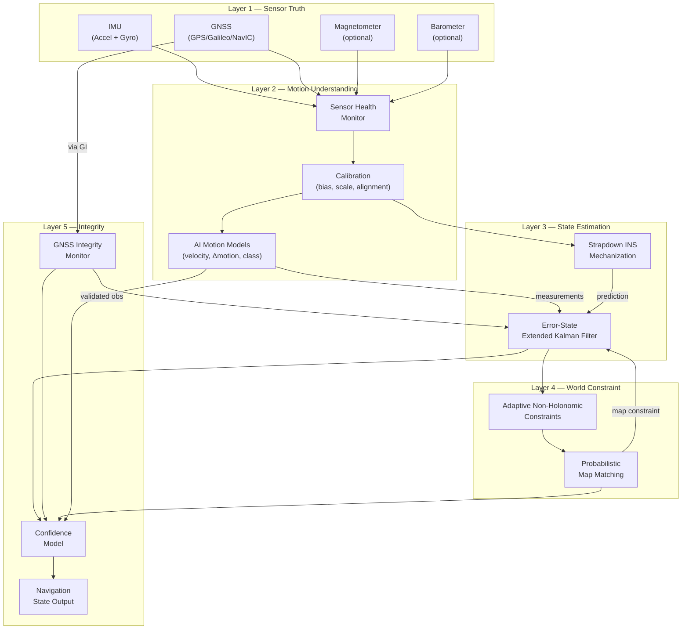
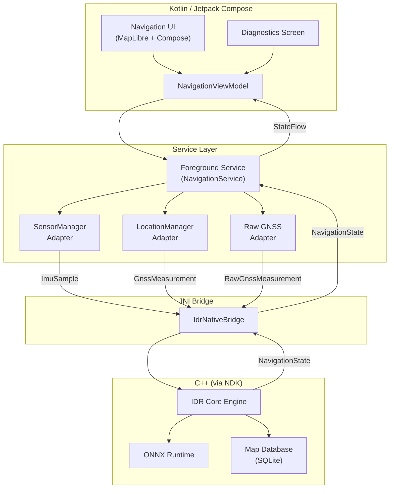
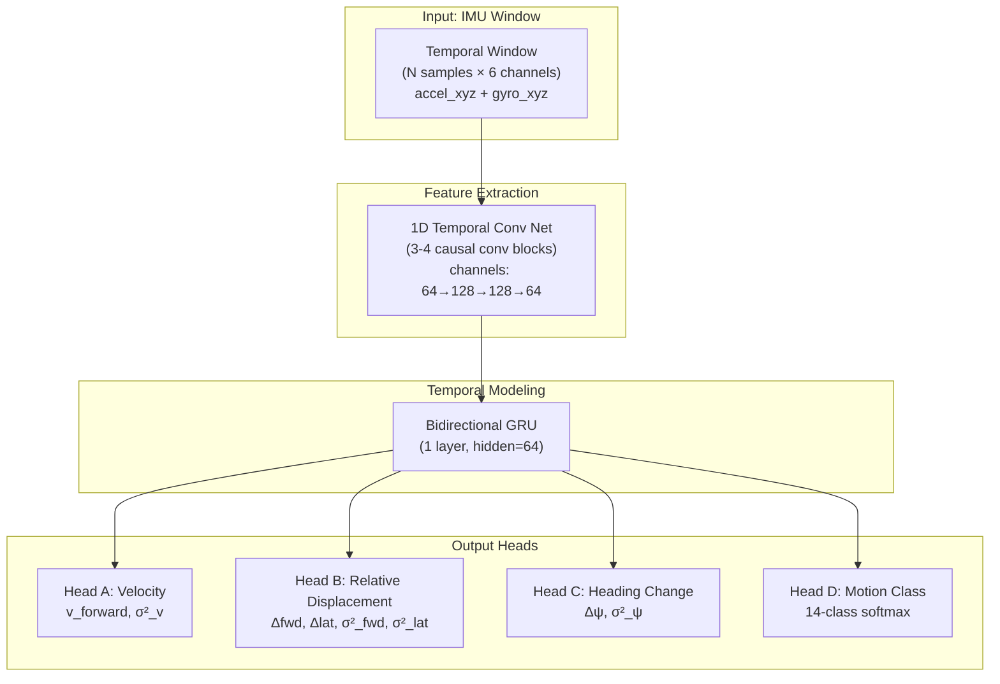
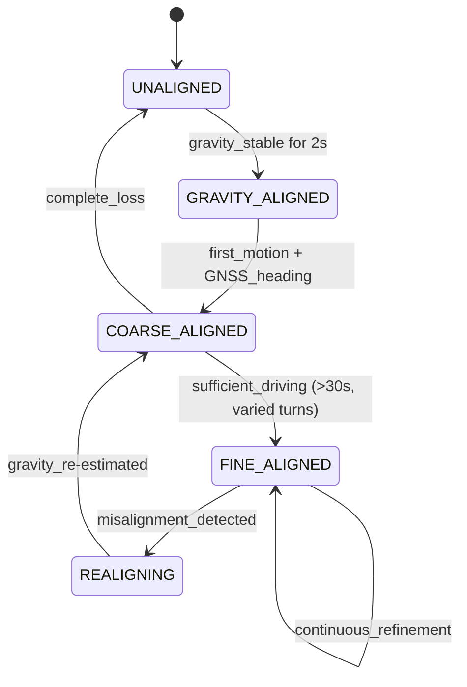
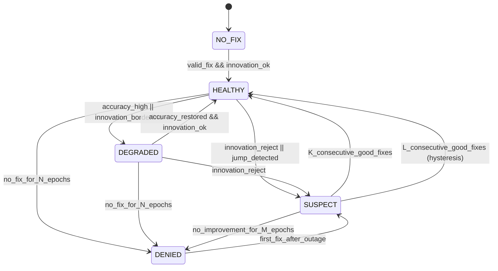
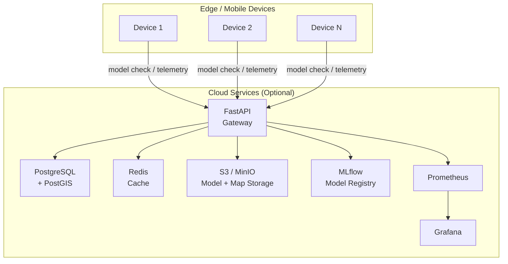

# IDR — Intelligent Dead Reckoning with GNSS Fusion

## Complete Project Blueprint

> **Document Classification:** Engineering Architecture Specification
> **Version:** 1.0.0-draft
> **Date:** 2026-09-29
> **Target:** SIH 2026 Screening → Production

---

## Table of Contents

1. [System Architecture](#1-system-architecture)
2. [Component Architecture](#2-component-architecture)
3. [Data-Flow Diagram](#3-data-flow-diagram)
4. [Android Architecture](#4-android-architecture)
5. [C++ Core Architecture](#5-c-core-architecture)
6. [ML Architecture](#6-ml-architecture)
7. [GNSS/INS Fusion Architecture](#7-gnssins-fusion-architecture)
8. [State Definition](#8-state-definition)
9. [Measurement Models](#9-measurement-models)
10. [Automatic Alignment Architecture](#10-automatic-alignment-architecture)
11. [Adaptive NHC Design](#11-adaptive-nhc-design)
12. [Map Graph Architecture](#12-map-graph-architecture)
13. [Map-Matching Algorithm](#13-map-matching-algorithm)
14. [GNSS Integrity Architecture](#14-gnss-integrity-architecture)
15. [Edge Deployment Architecture](#15-edge-deployment-architecture)
16. [Cloud/MLOps Architecture](#16-cloudmlops-architecture)
17. [Database Design](#17-database-design)
18. [Repository Structure](#18-repository-structure)
19. [Technology Choices with Justification](#19-technology-choices-with-justification)
20. [Interface Contracts](#20-interface-contracts)
21. [Data Schemas](#21-data-schemas)
22. [Testing Architecture](#22-testing-architecture)
23. [Benchmark Architecture](#23-benchmark-architecture)
24. [Failure-Mode Matrix](#24-failure-mode-matrix)
25. [Implementation Roadmap](#25-implementation-roadmap)

---

## 1. System Architecture

### 1.1 Architectural Philosophy

IDR is a **hybrid probabilistic localization engine** — not a GPS wrapper, not a pure ML system. The architecture enforces a strict separation between:

- **Sensing** — raw data acquisition from heterogeneous sources
- **Perception** — AI-learned vehicle motion understanding
- **Estimation** — physics-based state estimation with probabilistic fusion
- **Constraint** — vehicle dynamics and road-network priors
- **Integrity** — multi-source confidence and trust management

> [!IMPORTANT]
> The AI model **never** directly produces latitude/longitude. It produces *measurements* (velocity, relative displacement, heading change, uncertainty) that the Error-State EKF fuses with classical inertial propagation, GNSS observations, vehicle constraints, and map information. The estimator is always the final authority.

### 1.2 Five-Layer Architecture



### 1.3 Dual-Platform Deployment Model

```
┌─────────────────────────────────────────────────────────┐
│                   IDR C++ Core Library                   │
│  (Platform-independent, sensor-agnostic, offline-first) │
├─────────────────────┬───────────────────────────────────┤
│   Mobile Runtime    │       Edge Runtime                │
│                     │                                   │
│  Android App        │  Linux ARM64/x86_64               │
│  Kotlin + JNI       │  Serial/UDP/CAN adapters          │
│  Phone IMU @ 100Hz  │  External IMU @ 200Hz+            │
│  Phone GNSS @ 1-10Hz│  External GNSS @ 1-20Hz           │
│  ONNX Runtime       │  ONNX Runtime (+ opt. TensorRT)   │
│  MapLibre Native    │  Headless or custom UI             │
│  Offline maps       │  Offline maps                     │
└─────────────────────┴───────────────────────────────────┘
```

### 1.4 Operational Modes

| Mode | GNSS State | Primary Sources | Expected Accuracy |
|------|-----------|----------------|-------------------|
| `GNSS_ONLY` | Healthy, no IMU yet | GNSS position/velocity | GNSS-limited (~2-5 m) |
| `GNSS_INS` | Healthy | GNSS + INS + AI + NHC + Map | Best available |
| `DEGRADED` | Intermittent/noisy | INS + AI + NHC + Map + selective GNSS | Gradually decreasing |
| `DEAD_RECKONING` | Denied | INS + AI + NHC + Map | Drift-bounded by SIH targets |
| `RECOVERY` | Returning | Covariance-aware GNSS reintegration | Converging to GNSS+INS |
| `LOW_CONFIDENCE` | Any | Uncertainty exceeds threshold | Honest degradation |

---

## 2. Component Architecture

### 2.1 Module Dependency Graph

```mermaid
graph LR
    subgraph "Foundation"
        TIM["timing/"]
        TYPES["types/"]
        MATH["math_utils/"]
    end

    subgraph "Sensing"
        SENS["sensors/"]
        HEALTH["sensor_health/"]
        CAL["calibration/"]
    end

    subgraph "Spatial"
        ALIGN["alignment/"]
        PREPROC["preprocessing/"]
    end

    subgraph "Navigation Core"
        INERT["inertial/"]
        NEURAL["neural/"]
        FUSION["fusion/"]
        CONSTR["constraints/"]
    end

    subgraph "World Model"
        MAPG["map_graph/"]
        MAPM["map_matching/"]
    end

    subgraph "Trust"
        INTEG["integrity/"]
        DIAG["diagnostics/"]
    end

    subgraph "Orchestration"
        ENGINE["engine/"]
    end

    TIM --> SENS
    TYPES --> SENS
    MATH --> CAL
    SENS --> HEALTH
    SENS --> CAL
    CAL --> ALIGN
    CAL --> PREPROC
    ALIGN --> INERT
    PREPROC --> INERT
    PREPROC --> NEURAL
    INERT --> FUSION
    NEURAL --> FUSION
    CONSTR --> FUSION
    MAPG --> MAPM
    MAPM --> FUSION
    HEALTH --> INTEG
    FUSION --> INTEG
    INTEG --> ENGINE
    DIAG --> ENGINE
    FUSION --> ENGINE
    MAPM --> ENGINE
end
```

### 2.2 Module Responsibilities

| Module | Responsibility | Key Classes/Structs |
|--------|---------------|-------------------|
| `timing/` | Monotonic timestamps, clock sync, dt validation | `Timestamp`, `TimestampValidator`, `ClockModel` |
| `types/` | Common data types, coordinate frames, units | `Vec3d`, `Quaterniond`, `GeoCoord`, `Frame` |
| `math_utils/` | Quaternion math, rotation, geodesic utilities | `QuaternionOps`, `RotationMatrix`, `GeodesicCalc` |
| `sensors/` | Sensor abstraction, sample structs | `ImuSample`, `GnssMeasurement`, `MagSample`, `BaroSample` |
| `sensor_health/` | Per-sensor health state machine | `SensorHealthMonitor`, `HealthState` |
| `calibration/` | Bias, scale-factor, noise estimation | `BiasEstimator`, `NoiseCharacterizer`, `CalibrationState` |
| `alignment/` | Phone-to-vehicle rotation estimation | `AlignmentEstimator`, `AlignmentState`, `GravityAligner` |
| `preprocessing/` | Low-pass filter, outlier rejection, gravity removal | `ImuPreprocessor`, `GravityRemover`, `OutlierDetector` |
| `inertial/` | Strapdown INS mechanization | `InsMechanization`, `InsState`, `AttitudePropagator` |
| `neural/` | ONNX Runtime bridge, model I/O | `OnnxInference`, `MotionEstimate`, `VelocityEstimate` |
| `fusion/` | Error-State EKF, measurement updates | `ErrorStateEkf`, `NominalState`, `ErrorState`, `MeasurementUpdate` |
| `constraints/` | Adaptive NHC, vehicle profiles | `NhcConstraint`, `VehicleProfile`, `ConstraintAdapter` |
| `map_graph/` | Road graph storage, spatial queries | `RoadGraph`, `RoadEdge`, `RoadNode`, `SpatialIndex` |
| `map_matching/` | Probabilistic HMM map matching | `HmmMapMatcher`, `RoadCandidate`, `MatchResult` |
| `integrity/` | GNSS integrity, innovation tests | `GnssIntegrityMonitor`, `IntegrityState`, `InnovationTest` |
| `diagnostics/` | Latency tracking, metric collection | `LatencyTracker`, `MetricCollector`, `DiagnosticSnapshot` |
| `engine/` | Top-level orchestrator, state machine | `IdrEngine`, `NavigationState`, `EngineConfig` |

---

## 3. Data-Flow Diagram

### 3.1 Per-Sample Processing Pipeline

```
IMU Sample (100-200 Hz)
│
├─► TimestampValidator
│     ├── dt validation (reject < 0, > 100ms)
│     ├── duplicate detection
│     ├── gap interpolation flag
│     └── monotonic enforcement
│
├─► SensorHealthMonitor
│     ├── saturation check (accel ±16g, gyro ±2000°/s)
│     ├── bias drift rate
│     ├── sample rate monitoring
│     └── → VALID / DEGRADED / INVALID
│
├─► ImuPreprocessor
│     ├── bias compensation (from CalibrationState)
│     ├── low-pass filter (configurable cutoff)
│     ├── gravity separation (from attitude estimate)
│     └── outlier rejection (Mahalanobis)
│
├─► AlignmentEstimator
│     ├── R_VP update (if in alignment/re-alignment)
│     └── phone-to-vehicle frame transform
│
├─► InsMechanization (vehicle frame → nav frame)
│     ├── attitude propagation (quaternion integration)
│     ├── specific force rotation
│     ├── gravity compensation
│     ├── velocity propagation
│     ├── position propagation
│     └── covariance propagation
│
├─► NeuralInference (at ~10-20 Hz, windowed)
│     ├── feature buffer accumulation
│     ├── window extraction (e.g., 200 samples = 1-2 sec)
│     ├── ONNX Runtime inference
│     └── outputs: velocity, Δdisplacement, Δheading, σ², motion class
│
└─► ErrorStateEKF
      ├── TIME UPDATE: from INS prediction
      ├── MEASUREMENT UPDATES (when available):
      │     ├── AI velocity measurement
      │     ├── AI relative displacement measurement
      │     ├── NHC pseudo-measurement (lateral_v ≈ 0, vertical_v ≈ 0)
      │     ├── GNSS position (if integrity=HEALTHY/DEGRADED)
      │     ├── GNSS velocity (if integrity=HEALTHY/DEGRADED)
      │     ├── Barometric altitude (optional)
      │     ├── Map constraint (if map_confidence > threshold)
      │     └── Magnetic heading (only if sensor_health=VALID and no distortion)
      ├── ERROR INJECTION into nominal state
      ├── ERROR STATE RESET
      └── → Updated NavigationState
```

### 3.2 GNSS Processing Pipeline

```
GNSS Fix (1-10 Hz)
│
├─► TimestampValidator
│     └── age check, staleness detection
│
├─► GnssIntegrityMonitor
│     ├── horizontal accuracy check
│     ├── speed consistency check
│     ├── innovation test (predicted vs observed)
│     ├── jump detection (Mahalanobis distance)
│     ├── multipath heuristics
│     ├── satellite count/geometry
│     └── → HEALTHY / DEGRADED / SUSPECT / DENIED
│
├─► State Machine Transition
│     ├── GNSS+INS → DEGRADED (if SUSPECT for N epochs)
│     ├── DEGRADED → DEAD_RECKONING (if DENIED for M epochs)
│     ├── DEAD_RECKONING → RECOVERY (if HEALTHY for K epochs)
│     └── RECOVERY → GNSS+INS (if innovation < threshold for L epochs)
│
└─► EKF Measurement Update (if HEALTHY or DEGRADED with inflated R)
      ├── position observation: z = [lat, lon, alt]
      ├── velocity observation: z = [vN, vE, vD]
      ├── R matrix scaled by reported accuracy + integrity state
      └── smooth correction (no hard reset)
```

### 3.3 Map Matching Pipeline (5-10 Hz)

```
Current EKF Position Estimate + Heading + Velocity
│
├─► Spatial Query (R-tree, radius = f(covariance))
│     └── candidate road edges within search radius
│
├─► Candidate Scoring
│     ├── geometric distance likelihood
│     ├── heading alignment likelihood
│     ├── speed compatibility (road type max speed)
│     ├── road level/elevation compatibility
│     └── topology continuity (from previous match)
│
├─► HMM Transition + Emission
│     ├── emission: candidate score
│     ├── transition: route plausibility (connectivity, turn geometry)
│     └── Viterbi forward pass (sliding window)
│
└─► Match Output
      ├── best road segment + longitudinal offset
      ├── matched heading
      ├── map confidence score
      ├── road level
      └── optional: heading constraint → EKF
```

---

## 4. Android Architecture

### 4.1 Application Layer Architecture



### 4.2 Key Android Components

| Component | Type | Responsibility |
|-----------|------|---------------|
| `NavigationService` | Foreground Service | Sensor acquisition, JNI orchestration, lifecycle management |
| `ImuSensorAdapter` | Kotlin class | Wraps `SensorManager`, handles `TYPE_ACCELEROMETER`, `TYPE_GYROSCOPE`, `TYPE_MAGNETIC_FIELD`, `TYPE_PRESSURE`, `TYPE_GRAVITY` |
| `GnssAdapter` | Kotlin class | Wraps `LocationManager`, `GnssMeasurementsEvent`, handles permissions |
| `IdrNativeBridge` | JNI class | C++ ↔ Kotlin marshaling: sensor push, state pull |
| `NavigationViewModel` | ViewModel | Exposes `StateFlow<NavigationUiState>`, handles UI logic |
| `NavigationScreen` | Composable | MapLibre map, vehicle marker, speed, heading, mode indicator |
| `DiagnosticsScreen` | Composable | IMU freq, GNSS health, AI speed, covariance, latency (SIH demo) |
| `MapPackManager` | Kotlin class | Offline tile/graph download, versioning, storage |
| `ModelManager` | Kotlin class | ONNX model loading, versioning, integrity checks |

### 4.3 Android Sensor Sampling Strategy

```kotlin
// Target rates (device-dependent)
val IMU_SENSOR_DELAY = SensorManager.SENSOR_DELAY_FASTEST  // ~100-500 Hz
val GNSS_MIN_INTERVAL_MS = 100L  // request 10 Hz
val GNSS_MIN_DISTANCE_M = 0f    // no distance filter

// Actual rate is device-dependent; the C++ core handles variable dt
```

> [!WARNING]
> Android does not guarantee sensor delivery rates. `SENSOR_DELAY_FASTEST` yields 100–500 Hz depending on device. The C++ core must handle variable `dt`, burst delivery, and dropped samples. Never assume `sample_index × fixed_dt`.

### 4.4 JNI Interface (Conceptual)

```cpp
// Native methods exposed to Kotlin
extern "C" {
    // Lifecycle
    JNIEXPORT jlong JNICALL Java_com_idr_native_IdrNativeBridge_createEngine(
        JNIEnv* env, jobject thiz, jstring configPath, jstring mapDbPath, jstring modelPath);
    JNIEXPORT void JNICALL Java_com_idr_native_IdrNativeBridge_destroyEngine(
        JNIEnv* env, jobject thiz, jlong engineHandle);

    // Sensor push
    JNIEXPORT void JNICALL Java_com_idr_native_IdrNativeBridge_pushImuSample(
        JNIEnv* env, jobject thiz, jlong engineHandle,
        jlong timestampNs, jfloat ax, jfloat ay, jfloat az,
        jfloat gx, jfloat gy, jfloat gz);
    JNIEXPORT void JNICALL Java_com_idr_native_IdrNativeBridge_pushGnssFix(
        JNIEnv* env, jobject thiz, jlong engineHandle,
        jlong timestampNs, jdouble lat, jdouble lon, jdouble alt,
        jfloat hAcc, jfloat vAcc, jfloat speed, jfloat speedAcc,
        jfloat bearing, jfloat bearingAcc, jint satCount);
    JNIEXPORT void JNICALL Java_com_idr_native_IdrNativeBridge_pushMagSample(
        JNIEnv* env, jobject thiz, jlong engineHandle,
        jlong timestampNs, jfloat mx, jfloat my, jfloat mz);
    JNIEXPORT void JNICALL Java_com_idr_native_IdrNativeBridge_pushBaroSample(
        JNIEnv* env, jobject thiz, jlong engineHandle,
        jlong timestampNs, jfloat pressureHpa);

    // State pull
    JNIEXPORT jobject JNICALL Java_com_idr_native_IdrNativeBridge_getNavigationState(
        JNIEnv* env, jobject thiz, jlong engineHandle);
    JNIEXPORT jobject JNICALL Java_com_idr_native_IdrNativeBridge_getDiagnostics(
        JNIEnv* env, jobject thiz, jlong engineHandle);

    // Configuration
    JNIEXPORT void JNICALL Java_com_idr_native_IdrNativeBridge_setVehicleType(
        JNIEnv* env, jobject thiz, jlong engineHandle, jint vehicleType);
    JNIEXPORT void JNICALL Java_com_idr_native_IdrNativeBridge_setMountPosition(
        JNIEnv* env, jobject thiz, jlong engineHandle, jint mountPosition);
}
```

### 4.5 Process Death / Background Handling

| Event | Strategy |
|-------|----------|
| App backgrounded | Foreground Service continues; notification shows mode |
| Process death | Serialize last `NavigationState` + `CalibrationState` to SharedPreferences; restore on restart |
| Low memory | Reduce map tile cache; maintain core engine |
| Battery saver | Reduce AI inference rate (10→5 Hz); maintain INS |
| Thermal throttle | Reduce map matching rate; report DEGRADED confidence |

---

## 5. C++ Core Architecture

### 5.1 Build System

```cmake
# Top-level CMakeLists.txt
cmake_minimum_required(VERSION 3.20)
project(idr-core VERSION 0.1.0 LANGUAGES CXX)

set(CMAKE_CXX_STANDARD 17)
set(CMAKE_CXX_STANDARD_REQUIRED ON)

# vcpkg integration
find_package(Eigen3 3.4 REQUIRED)
find_package(spdlog REQUIRED)
find_package(GeographicLib REQUIRED)
find_package(onnxruntime REQUIRED)
find_package(SQLiteCpp REQUIRED)
find_package(GTest REQUIRED)

add_library(idr-core STATIC
    src/timing/timestamp.cpp
    src/sensors/imu_sample.cpp
    src/sensors/gnss_measurement.cpp
    src/sensor_health/sensor_health_monitor.cpp
    src/calibration/bias_estimator.cpp
    src/alignment/alignment_estimator.cpp
    src/preprocessing/imu_preprocessor.cpp
    src/inertial/ins_mechanization.cpp
    src/neural/onnx_inference.cpp
    src/fusion/error_state_ekf.cpp
    src/constraints/nhc_constraint.cpp
    src/map_graph/road_graph.cpp
    src/map_matching/hmm_map_matcher.cpp
    src/integrity/gnss_integrity_monitor.cpp
    src/diagnostics/latency_tracker.cpp
    src/engine/idr_engine.cpp
)

target_link_libraries(idr-core PUBLIC
    Eigen3::Eigen
    spdlog::spdlog
    GeographicLib::GeographicLib
    onnxruntime::onnxruntime
    SQLiteCpp
)

target_include_directories(idr-core PUBLIC
    $<BUILD_INTERFACE:${CMAKE_CURRENT_SOURCE_DIR}/include>
    $<INSTALL_INTERFACE:include>
)
```

### 5.2 Header Organization

```
core/
├── include/
│   └── idr/
│       ├── timing/
│       │   ├── timestamp.h
│       │   └── timestamp_validator.h
│       ├── types/
│       │   ├── common.h          // Vec3d, Quaterniond, GeoCoord
│       │   ├── frames.h          // Frame enum, frame conventions
│       │   └── units.h           // unit documentation
│       ├── math_utils/
│       │   ├── quaternion_ops.h
│       │   ├── rotation.h
│       │   └── geodesic.h
│       ├── sensors/
│       │   ├── imu_sample.h
│       │   ├── gnss_measurement.h
│       │   ├── mag_sample.h
│       │   └── baro_sample.h
│       ├── sensor_health/
│       │   └── sensor_health_monitor.h
│       ├── calibration/
│       │   ├── bias_estimator.h
│       │   ├── noise_characterizer.h
│       │   └── calibration_state.h
│       ├── alignment/
│       │   ├── alignment_estimator.h
│       │   ├── gravity_aligner.h
│       │   └── alignment_state.h
│       ├── preprocessing/
│       │   ├── imu_preprocessor.h
│       │   ├── low_pass_filter.h
│       │   └── outlier_detector.h
│       ├── inertial/
│       │   ├── ins_mechanization.h
│       │   ├── ins_state.h
│       │   └── attitude_propagator.h
│       ├── neural/
│       │   ├── onnx_inference.h
│       │   ├── motion_estimate.h
│       │   └── model_config.h
│       ├── fusion/
│       │   ├── error_state_ekf.h
│       │   ├── nominal_state.h
│       │   ├── error_state.h
│       │   └── measurement_update.h
│       ├── constraints/
│       │   ├── nhc_constraint.h
│       │   ├── vehicle_profile.h
│       │   └── constraint_adapter.h
│       ├── map_graph/
│       │   ├── road_graph.h
│       │   ├── road_edge.h
│       │   ├── road_node.h
│       │   └── spatial_index.h
│       ├── map_matching/
│       │   ├── hmm_map_matcher.h
│       │   ├── road_candidate.h
│       │   └── match_result.h
│       ├── integrity/
│       │   ├── gnss_integrity_monitor.h
│       │   ├── integrity_state.h
│       │   └── innovation_test.h
│       ├── diagnostics/
│       │   ├── latency_tracker.h
│       │   ├── metric_collector.h
│       │   └── diagnostic_snapshot.h
│       └── engine/
│           ├── idr_engine.h
│           ├── engine_config.h
│           └── navigation_state.h
└── src/
    └── ... (mirrors include structure)
```

### 5.3 Coordinate Frame Conventions

> [!IMPORTANT]
> All coordinate frames must be documented explicitly. Mixing NED/ENU or body/phone/vehicle frames is a category of bug that causes silent position divergence.

| Frame | Convention | Axes | Usage |
|-------|-----------|------|-------|
| **Phone (P)** | Android sensor frame | x=right, y=up, z=out-of-screen | Raw sensor data |
| **Vehicle (V)** | SAE J670 (modified) | x=forward, y=left, z=up | Vehicle dynamics, NHC |
| **Navigation (N)** | ENU | x=East, y=North, z=Up | Position, map matching |
| **ECEF** | WGS84 | Standard ECEF | Geodesic calculations |
| **LLA** | WGS84 | lat/lon/alt (degrees/meters) | GNSS, map, output |

**Rotation convention:** All rotations stored as unit quaternions (Hamilton convention, scalar-first: `[w, x, y, z]`). Euler angles used only for human display, never for internal computation.

**Units:**
- Acceleration: m/s²
- Angular rate: rad/s
- Position: WGS84 degrees or ENU meters (from origin)
- Velocity: m/s
- Heading: radians, clockwise from North (for output); internally ENU angle
- Pressure: hPa
- Magnetic field: µT
- Timestamps: nanoseconds (monotonic) internally; epoch-referenced for output

---

## 6. ML Architecture

### 6.1 Model Overview



### 6.2 Model A — Motion/Vibration Classifier

**Purpose:** Classify current vehicle motion state to adapt NHC strength, filter aggressiveness, and AI model confidence.

**Architecture:**

```
Input: [batch, window=200, channels=6] (accel_xyz + gyro_xyz, ~2s at 100Hz)
  │
  ├─► 1D Conv Block (kernel=7, channels=32, stride=2) + BatchNorm + ReLU
  ├─► 1D Conv Block (kernel=5, channels=64, stride=2) + BatchNorm + ReLU
  ├─► 1D Conv Block (kernel=3, channels=64, stride=1) + BatchNorm + ReLU
  │
  ├─► Global Average Pooling
  ├─► Linear(64 → 32) + ReLU + Dropout(0.2)
  └─► Linear(32 → 14) + Softmax

Output: 14-class probability vector
```

**Classes:**

| Index | Class | NHC Implication |
|-------|-------|----------------|
| 0 | `STATIONARY` | Strong NHC, zero velocity constraint |
| 1 | `NORMAL_DRIVING` | Strong NHC |
| 2 | `ACCELERATION` | Strong NHC |
| 3 | `HARD_BRAKING` | Strong NHC |
| 4 | `SHARP_TURN` | Relaxed lateral NHC |
| 5 | `ROUNDABOUT` | Relaxed lateral NHC |
| 6 | `POTHOLE` | Maintain NHC, increase accel noise |
| 7 | `SPEED_BREAKER` | Maintain NHC, increase accel noise |
| 8 | `VIBRATION` | Increase accel noise floor |
| 9 | `REVERSE` | Negative velocity constraint |
| 10 | `U_TURN` | Relaxed NHC |
| 11 | `PARKING` | Weak NHC, low speed |
| 12 | `PHONE_MOVEMENT` | Inflate alignment covariance |
| 13 | `UNUSUAL_MOTION` | Weak NHC |

**Estimated size:** ~50K parameters, <0.5 MB ONNX

### 6.3 Model B — Learned Forward Velocity Estimator

**Purpose:** Estimate instantaneous forward vehicle speed from IMU temporal patterns. This is a *pseudo-measurement* — absolute speed is not directly observable from acceleration alone at constant velocity. The model learns speed-correlated vibration signatures, turn dynamics, and acceleration patterns.

**Architecture:**

```
Input: [batch, window=200, channels=9]
       (accel_xyz + gyro_xyz + gravity_xyz)
  │
  ├─► TCN Block 1: Conv1d(9→64, k=7, dilation=1) + BN + ReLU
  ├─► TCN Block 2: Conv1d(64→128, k=5, dilation=2) + BN + ReLU + Residual
  ├─► TCN Block 3: Conv1d(128→128, k=3, dilation=4) + BN + ReLU + Residual
  ├─► TCN Block 4: Conv1d(128→64, k=3, dilation=8) + BN + ReLU + Residual
  │
  ├─► GRU(input=64, hidden=64, layers=1, bidirectional=True)
  ├─► Take last hidden state → [batch, 128]
  │
  ├─► Velocity Head:
  │     Linear(128→32) + ReLU
  │     Linear(32→1) + ReLU (velocity ≥ 0)
  │
  └─► Uncertainty Head:
        Linear(128→32) + ReLU
        Linear(32→1) + Softplus (σ² > 0)

Output: v_forward (m/s), σ²_v (m²/s²)
```

**Training loss:** Negative log-likelihood (Gaussian):

```
L = 0.5 * (log(σ²) + (v_true - v_pred)² / σ²)
```

This naturally trains both the prediction and its uncertainty.

**Estimated size:** ~200K parameters, ~1 MB ONNX

> [!NOTE]
> **Physics limitation acknowledgment:** At constant velocity on a straight road, longitudinal acceleration ≈ 0, making absolute speed unobservable from instantaneous acceleration. The model relies on: (1) vibration spectral patterns that correlate with speed, (2) turn dynamics where centripetal acceleration reveals speed, (3) acceleration/deceleration events, (4) temporal context. The EKF appropriately weights this learned measurement via σ².

### 6.4 Model C — Learned Relative Inertial Odometry

**Purpose:** Estimate short-window relative displacement and heading change. Inspired by TLIO's approach of predicting displacement rather than absolute position.

**Architecture:**

```
Input: [batch, window=200, channels=6] (accel_xyz + gyro_xyz)
  │
  ├─► Same TCN+GRU backbone as Model B (shared or separate)
  │   (can be multi-task from same backbone)
  │
  ├─► Displacement Head:
  │     Linear(128→32) + ReLU
  │     Linear(32→2) → (Δforward, Δlateral) in meters
  │
  ├─► Heading Head:
  │     Linear(128→32) + ReLU
  │     Linear(32→1) → Δheading in radians
  │
  └─► Uncertainty Head:
        Linear(128→32) + ReLU
        Linear(32→3) + Softplus → (σ²_fwd, σ²_lat, σ²_hdg)

Output: Δfwd (m), Δlat (m), Δψ (rad), σ²_fwd, σ²_lat, σ²_ψ
```

**Estimated size:** ~250K parameters, ~1.2 MB ONNX

### 6.5 Unified Multi-Task Model (Recommended for Deployment)

For mobile efficiency, Models B and C share a backbone with separate heads:

```
Input: [batch, 200, 9] (accel + gyro + gravity)
  │
  ├─► Shared TCN Backbone (~150K params)
  ├─► Shared GRU (~65K params)
  │
  ├─► Velocity Head (~5K params)
  ├─► Displacement Head (~5K params)
  ├─► Heading Head (~5K params)
  ├─► Uncertainty Head (~5K params)
  └─► Motion Class Head (~5K params)

Total: ~240K parameters
ONNX FP32: ~1.2 MB
ONNX FP16: ~0.6 MB
ONNX INT8:  ~0.3 MB
```

**Inference budget:** Single forward pass ≤ 5 ms on mid-range Android CPU (benchmarked on Snapdragon 6 Gen 1).

### 6.6 Training Pipeline

```
IO-VNBD raw CSV
  │
  ├─► validate_dataset.py
  │     ├── check column names, dtypes
  │     ├── detect missing fields
  │     ├── report statistics
  │     └── flag anomalies
  │
  ├─► preprocess.py
  │     ├── timestamp normalization (seconds from epoch → relative)
  │     ├── sensor synchronization (nearest-neighbor interpolation)
  │     ├── coordinate normalization (ENU from first GPS fix)
  │     ├── unit conversion (deg→rad, etc.)
  │     ├── initial bias estimation (first 5s stationary if available)
  │     └── output → Parquet files
  │
  ├─► generate_windows.py
  │     ├── sliding window extraction (200 samples, stride 50)
  │     ├── ground truth computation (GPS displacement, speed)
  │     ├── drive/route/vehicle-aware train/val/test split
  │     └── output → Parquet window files
  │
  ├─► augment.py
  │     ├── random rotation (simulate phone orientation change)
  │     ├── bias injection (simulate uncalibrated sensor)
  │     ├── noise injection (simulate different sensor quality)
  │     ├── time stretch (±5% to simulate different speeds)
  │     └── gravity perturbation
  │
  ├─► train.py
  │     ├── PyTorch DataLoader (from Parquet via Polars)
  │     ├── multi-task loss (velocity + displacement + heading + class)
  │     ├── AdamW optimizer, OneCycleLR scheduler
  │     ├── gradient clipping, early stopping
  │     ├── MLflow experiment tracking
  │     └── checkpoint saving
  │
  ├─► evaluate.py
  │     ├── held-out route/driver test set
  │     ├── per-window metrics
  │     ├── cumulative trajectory error
  │     ├── synthetic GNSS outage evaluation
  │     └── percentile error reporting
  │
  └─► export.py
        ├── PyTorch → ONNX (opset 17)
        ├── ONNX simplification (onnx-simplifier)
        ├── FP16 quantization + accuracy check
        ├── INT8 quantization + accuracy check
        ├── mobile benchmark (inference time, memory)
        └── model manifest generation
```

### 6.7 Data Split Strategy

```
IO-VNBD Dataset
  │
  ├─► Identify unique drives/routes/vehicles
  │
  ├─► TRAIN (60%): Routes A, B, C — Vehicles 1, 2
  ├─► VALIDATION (20%): Routes D, E — Vehicle 1 (different routes)
  └─► TEST (20%): Routes F, G — Vehicle 3 (unseen vehicle + routes)

NEVER: random sample-level split of temporally adjacent windows
```

### 6.8 Augmentation Strategy

| Augmentation | Simulates | Probability |
|-------------|-----------|-------------|
| Random SO(3) rotation | Phone orientation change | 0.5 |
| Additive Gaussian noise (σ=0.01-0.1 m/s²) | Different sensor quality | 0.3 |
| Bias offset (accel ±0.1 m/s², gyro ±0.01 rad/s) | Uncalibrated sensor | 0.3 |
| Sample dropout (1-3 random samples zeroed) | Packet loss | 0.1 |
| Time jitter (±1ms per sample) | Clock instability | 0.2 |
| Gravity direction perturbation (±2°) | Alignment error | 0.2 |

---

## 7. GNSS/INS Fusion Architecture

### 7.1 Estimator Selection: Why Error-State EKF

| Criterion | Standard EKF | Error-State EKF | UKF | Particle Filter |
|-----------|-------------|-----------------|-----|-----------------|
| Linearization quality | Poor for large angles | Excellent (small errors) | Good | N/A |
| Quaternion handling | Overparameterized | 3-DOF error vector | Complex | Complex |
| Computational cost | Low | Low | Medium | High |
| Implementation complexity | Medium | Medium | Medium | High |
| Real-time viability (10Hz+) | Yes | Yes | Yes | Marginal at 200Hz |
| Established INS/GNSS usage | Common | Industry standard | Research | Research |
| Bias estimation | Works | Works well | Works | Expensive |

**Decision:** Error-State EKF (ES-EKF) is the industry standard for INS/GNSS fusion. It naturally handles quaternion-based attitude estimation with a 3-element error parameterization, keeping the error state small and the linearization valid.

**Why not UKF:** Marginal accuracy improvement does not justify ~3× computational cost at high IMU rates. Can be revisited experimentally.

**Why not particle filter for fusion:** Computationally infeasible at 200 Hz for a 17+ dimensional state. Reserved for map matching where the state space is discrete (road candidates).

### 7.2 Filter Timing Architecture

```
Time ────────────────────────────────────────────────►

IMU:  |─|─|─|─|─|─|─|─|─|─|─|─|─|─|─|─|─|─|─|─|  (100-200 Hz)
       P P P P P P P P P P P P P P P P P P P P P   P = Predict

GNSS: |─────────|─────────|─────────|─────────|─────  (1-10 Hz)
                 U                   U              U = Update (position + velocity)

AI:   |───|───|───|───|───|───|───|───|───|───|─────  (10-20 Hz)
          U       U       U       U       U        U = Update (velocity + displacement)

NHC:  |─|─|─|─|─|─|─|─|─|─|─|─|─|─|─|─|─|─|─|─|  (every IMU step)
       U U U U U U U U U U U U U U U U U U U U U  U = Pseudo-measurement

MAP:  |──────|──────|──────|──────|──────|──────|───  (5-10 Hz)
             U            U            U            U = Heading/position constraint
```

### 7.3 Fusion Hierarchy

The EKF processes measurements in a principled order. When multiple measurements arrive at the same timestamp:

1. **INS Prediction** (highest rate) — always runs
2. **NHC Pseudo-measurement** — always applied (strength varies)
3. **AI Velocity/Displacement** — applied when new inference available
4. **GNSS Position/Velocity** — applied only if integrity ≥ DEGRADED
5. **Map Constraint** — applied only if map_confidence > threshold
6. **Barometric Altitude** — applied when available and consistent
7. **Magnetic Heading** — applied only when sensor_health = VALID and no distortion detected

---

## 8. State Definition

### 8.1 Nominal State (propagated by INS)

```
x_nominal = {
    p       : Vec3d       // Position in ENU (meters) [3]
    v       : Vec3d       // Velocity in ENU (m/s) [3]
    q       : Quaterniond // Attitude (nav-to-body) [4, stored as unit quaternion]
    a_bias  : Vec3d       // Accelerometer bias (m/s²) [3]
    g_bias  : Vec3d       // Gyroscope bias (rad/s) [3]
}
// Total: 16 components (3+3+4+3+3), but quaternion has 3 DOF
```

### 8.2 Error State (estimated by EKF)

```
δx = {
    δp      : Vec3d  // Position error (m) [3]
    δv      : Vec3d  // Velocity error (m/s) [3]
    δθ      : Vec3d  // Attitude error (rad, small-angle) [3]
    δa_bias : Vec3d  // Accelerometer bias error (m/s²) [3]
    δg_bias : Vec3d  // Gyroscope bias error (rad/s) [3]
    δs_v    : double // Velocity scale error [1]  (optional Phase 2+)
    δψ_align: Vec3d  // Alignment error (rad) [3] (optional Phase 2+)
}
// Minimal state: 15 elements
// Extended state: 19 elements
```

### 8.3 Covariance Matrix

```
P ∈ R^(n×n)  where n = dim(δx)

P = [P_pp   P_pv   P_pθ   P_pa   P_pg   ...]
    [P_vp   P_vv   P_vθ   P_va   P_vg   ...]
    [P_θp   P_θv   P_θθ   P_θa   P_θg   ...]
    [P_ap   P_av   P_aθ   P_aa   P_ag   ...]
    [P_gp   P_gv   P_gθ   P_ga   P_gg   ...]
    [...    ...    ...    ...    ...    ...]
```

### 8.4 Process Noise (Q)

| Component | Source | Typical Smartphone Value | Units |
|-----------|--------|-------------------------|-------|
| Accel noise density | Sensor datasheet | 0.01 – 0.05 | m/s²/√Hz |
| Gyro noise density | Sensor datasheet | 0.001 – 0.01 | rad/s/√Hz |
| Accel bias instability | Allan variance | 0.001 – 0.01 | m/s²/√s |
| Gyro bias instability | Allan variance | 0.0001 – 0.001 | rad/s/√s |
| Velocity scale drift | Empirical | 0.001 | 1/√s |

Q is scaled by `dt` and adapted based on motion class (e.g., increased during vibration/pothole).

### 8.5 State Injection (Reset)

After each EKF update:

```cpp
// Inject error into nominal state
p_nominal += δp;
v_nominal += δv;
q_nominal = q_nominal ⊗ δq(δθ);  // quaternion multiplicative correction
a_bias += δa_bias;
g_bias += δg_bias;

// Reset error state to zero
δx = 0;

// Transform covariance (ESKF reset)
// P+ = G * P * G^T  where G accounts for the injection
```

### 8.6 Navigation State Output

```cpp
struct NavigationState {
    // Core state
    double latitude_deg;
    double longitude_deg;
    double altitude_m;
    double velocity_north_mps;
    double velocity_east_mps;
    double velocity_down_mps;
    double speed_mps;
    double heading_deg;          // clockwise from North
    double pitch_deg;
    double roll_deg;

    // Accuracy / uncertainty
    double horizontal_accuracy_m;   // 1σ from covariance
    double vertical_accuracy_m;
    double velocity_accuracy_mps;
    double heading_accuracy_deg;

    // Mode and confidence
    NavigationMode mode;            // GNSS, GNSS_INS, DEGRADED, DEAD_RECKONING, LOW_CONFIDENCE
    double gnss_confidence;         // [0, 1]
    double ai_confidence;           // [0, 1]
    double map_confidence;          // [0, 1]
    IntegrityStatus integrity;      // NOMINAL, CAUTION, WARNING, ALERT

    // Map matching
    int64_t matched_road_id;
    double matched_road_confidence;
    int road_level;

    // Metadata
    int64_t timestamp_ns;
    uint32_t update_count;
    double ins_propagation_latency_ms;
    double total_latency_ms;
};
```

---

## 9. Measurement Models

### 9.1 GNSS Position Measurement

```
Observation:  z_gnss_pos = [lat, lon, alt] (converted to ENU from origin)
Predicted:    ẑ = H * x_nominal → [p_E, p_N, p_U]
Innovation:   y = z - ẑ
Jacobian:     H_gnss_pos = [I₃   0₃   0₃   0₃   0₃]  (15×3 → maps δp)

R_gnss_pos = diag(σ²_h, σ²_h, σ²_v)
  where σ_h = max(reported_hAcc, min_gnss_sigma)
        σ_v = max(reported_vAcc, min_gnss_sigma_v)

If integrity = DEGRADED:
  R_gnss_pos *= inflation_factor (e.g., 4×)
If integrity = SUSPECT:
  measurement rejected
```

### 9.2 GNSS Velocity Measurement

```
Observation:  z_gnss_vel = [vE, vN, vD] (from GNSS Doppler)
Predicted:    ẑ = [v_E, v_N, v_D] from nominal state
Innovation:   y = z - ẑ
Jacobian:     H_gnss_vel = [0₃   I₃   0₃   0₃   0₃]

R_gnss_vel = diag(σ²_speed, σ²_speed, σ²_speed_v)
  where σ_speed = max(reported_speedAcc, 0.1 m/s)
```

### 9.3 AI Velocity Measurement

```
Observation:  z_ai_vel = v_forward (scalar, in vehicle frame)
Predicted:    ẑ = |v_body_x| (forward velocity from state, projected to vehicle frame)

Innovation:   y = z_ai_vel - ẑ
Jacobian:     H_ai_vel = ∂v_forward/∂δx
              = [0₁ₓ₃   R_NV[0,:] * sign   -(R_NB × v_N)_cross_terms   0₁ₓ₃   0₁ₓ₃]

R_ai_vel = σ²_ai (from model's uncertainty head)
         × confidence_scale (based on motion class)
```

### 9.4 AI Relative Displacement Measurement

```
Observation:  z_ai_disp = [Δfwd, Δlat, Δψ] (in vehicle frame, over window Δt)
Predicted:    ẑ = accumulated INS displacement over same window

Innovation:   y = z - ẑ
Jacobian:     H_ai_disp (linearized around current state)

R_ai_disp = diag(σ²_fwd, σ²_lat, σ²_ψ) (from model's uncertainty head)
```

> [!NOTE]
> The relative displacement measurement uses stochastic cloning (TLIO-style): the state at window start is cloned, and the measurement constrains the difference between cloned and current state. This avoids accumulating errors from the absolute frame.

### 9.5 Non-Holonomic Constraint (NHC) Pseudo-Measurement

```
Observation:  z_nhc = [v_lateral, v_vertical] = [0, 0]  (vehicle frame)
Predicted:    ẑ = R_NV^T * v_N → extract lateral and vertical components

Innovation:   y = [0, 0] - [v_lat_predicted, v_vert_predicted]
Jacobian:     H_nhc = ∂[v_lat, v_vert]/∂δx

R_nhc = diag(σ²_lat, σ²_vert)
  σ²_lat = f(motion_class, vehicle_type)
  σ²_vert = f(road_type, vehicle_type)
```

Adaptive R_nhc:

| Condition | σ²_lateral | σ²_vertical |
|-----------|-----------|-------------|
| Normal driving (car) | 0.01 m²/s² | 0.01 m²/s² |
| Sharp turn (car) | 0.25 m²/s² | 0.01 m²/s² |
| Roundabout | 0.50 m²/s² | 0.01 m²/s² |
| Two-wheeler normal | 0.10 m²/s² | 0.04 m²/s² |
| Two-wheeler lean | 1.00 m²/s² | 0.25 m²/s² |
| Skid / unusual | 4.00 m²/s² | 1.00 m²/s² |
| Parking / reverse | 1.00 m²/s² | 0.10 m²/s² |
| Stationary | 0.001 m²/s² | 0.001 m²/s² |

### 9.6 Barometric Altitude Measurement

```
Observation:  z_baro = altitude_from_pressure (using ISA + local calibration)
Predicted:    ẑ = p_U (from nominal state)

H_baro = [0 0 1 | 0₁ₓ₁₂]  (extracts Up component of position)
R_baro = σ²_baro (~5-20 m², depending on calibration quality)
```

### 9.7 Map Heading Constraint

```
Observation:  z_map_hdg = matched_road_heading (from map matching)
Predicted:    ẑ = atan2(v_E, v_N) or heading from attitude

H_map_hdg = ∂heading/∂δx
R_map_hdg = σ²_map_hdg (scaled inversely by map_confidence)

Applied only when:
  map_confidence > 0.6
  speed > 3 m/s (heading undefined at low speed)
  single dominant road candidate (no ambiguity)
```

---

## 10. Automatic Alignment Architecture

### 10.1 Problem Statement

The phone can be in any orientation within the vehicle. We must estimate the rotation matrix **R_VP** (Vehicle-from-Phone) that transforms phone-frame measurements into the vehicle frame.

```
a_vehicle = R_VP * a_phone
ω_vehicle = R_VP * ω_phone
```

### 10.2 Alignment State Machine



### 10.3 Alignment Estimation Stages

**Stage 1 — Gravity Alignment (Stationary, ~2s)**

```
Given: gravity vector in phone frame g_P = mean(accel_samples_stationary)
Known: gravity in navigation frame g_N = [0, 0, -9.81]

Solve for pitch and roll:
  pitch = atan2(-g_P.x, sqrt(g_P.y² + g_P.z²))
  roll  = atan2(g_P.y, g_P.z)

Also estimate:
  accel_bias = g_P - R(pitch,roll) * g_N  (residual = bias estimate)
  gyro_bias  = mean(gyro_samples_stationary)
```

**Stage 2 — Coarse Yaw Alignment (First Motion)**

```
When vehicle starts moving and GNSS course is available:
  GNSS_heading = bearing from consecutive GNSS fixes (speed > 3 m/s)
  gyro_heading = integrated yaw from gyroscope

  yaw_phone_to_vehicle = GNSS_heading - gyro_heading
  R_VP = R_yaw * R_pitch_roll (from Stage 1)
```

**Stage 3 — Fine Alignment (Continuous)**

```
During driving, refine R_VP using:
  - GNSS velocity direction vs. IMU-predicted forward direction
  - Turn events (high gyro + GNSS heading change → strong observability)
  - Map heading when available
  - AI-predicted motion direction

Use a separate small EKF or complementary filter for alignment:
  State: δR_VP (3-element Euler error)
  Measurements: heading residuals during turns
  Update rate: every GNSS fix with speed > 5 m/s
```

### 10.4 Misalignment Detection

Continuous monitoring for phone movement:

```
Triggers:
  1. Sudden accelerometer bias change (Δbias > 0.5 m/s² within 1s)
  2. Sudden gravity direction change (angle > 10° within 0.5s)
  3. Heading residual spike (predicted vs GNSS > 30° for multiple epochs)
  4. AI motion class = PHONE_MOVEMENT

Response:
  1. Set alignment_state = REALIGNING
  2. Inflate alignment covariance in main EKF (×100)
  3. Reduce NHC strength (×0.1)
  4. Increase AI uncertainty weighting (×3)
  5. Begin new gravity estimation when next stationary period detected
  6. Resume coarse yaw alignment at next motion event
```

---

## 11. Adaptive NHC Design

### 11.1 Vehicle Profiles

```cpp
struct VehicleProfile {
    VehicleType type;           // CAR, TRUCK_BUS, TWO_WHEELER, UNKNOWN
    double wheelbase_m;         // approximate (for turn radius estimation)
    double max_lateral_accel;   // m/s² before expected slip
    double max_speed_mps;       // sanity bound
    double nhc_lateral_sigma;   // base lateral NHC noise
    double nhc_vertical_sigma;  // base vertical NHC noise
    bool has_lean;              // two-wheelers lean in turns
};

// Preset profiles
const VehicleProfile CAR          = {CAR,         2.7, 8.0, 55, 0.1, 0.1, false};
const VehicleProfile TRUCK_BUS    = {TRUCK_BUS,   6.0, 5.0, 35, 0.15, 0.15, false};
const VehicleProfile TWO_WHEELER  = {TWO_WHEELER, 1.4, 6.0, 45, 0.3, 0.2, true};
const VehicleProfile UNKNOWN      = {UNKNOWN,     2.5, 7.0, 50, 0.2, 0.15, false};
```

### 11.2 NHC Adaptation Logic

```cpp
double computeNhcLateralSigma(const VehicleProfile& vp,
                               const MotionClass& mc,
                               double yaw_rate,
                               double speed) {
    double base = vp.nhc_lateral_sigma;

    // Adapt based on motion class
    switch (mc) {
        case STATIONARY:     return base * 0.1;   // very tight
        case NORMAL_DRIVING: return base * 1.0;
        case SHARP_TURN:     return base * 5.0;   // relaxed
        case ROUNDABOUT:     return base * 7.0;
        case U_TURN:         return base * 10.0;  // very relaxed
        case PARKING:        return base * 10.0;
        case UNUSUAL_MOTION: return base * 20.0;  // nearly disabled
        default:             return base * 2.0;
    }

    // Further adapt for two-wheeler lean
    if (vp.has_lean && abs(yaw_rate) > 0.1) {
        base *= (1.0 + 5.0 * abs(yaw_rate));  // lean angle correlates with yaw rate
    }

    // Speed-dependent: at very low speed, NHC is less reliable
    if (speed < 1.0) base *= 5.0;

    return base;
}
```

### 11.3 Zero-Velocity Update (ZUPT)

When `motion_class == STATIONARY` for > 1s:

```
z_zupt = [0, 0, 0]  (all velocity components)
H_zupt = [0₃ I₃ 0₃ 0₃ 0₃]
R_zupt = diag(0.001, 0.001, 0.001) m²/s²  // very tight

Also: update gyro bias estimate from stationary gyro readings
```

---

## 12. Map Graph Architecture

### 12.1 Road Graph Schema

```sql
-- SQLite database with R-tree spatial index

CREATE TABLE road_nodes (
    node_id     INTEGER PRIMARY KEY,
    lat         REAL NOT NULL,
    lon         REAL NOT NULL,
    elevation   REAL,              -- meters, NULL if unknown
    level       INTEGER DEFAULT 0  -- road level (0=ground, 1=flyover, -1=underpass)
);

CREATE TABLE road_edges (
    edge_id         INTEGER PRIMARY KEY,
    start_node_id   INTEGER NOT NULL REFERENCES road_nodes(node_id),
    end_node_id     INTEGER NOT NULL REFERENCES road_nodes(node_id),
    road_type       INTEGER NOT NULL,  -- enum: MOTORWAY, TRUNK, PRIMARY, SECONDARY, ...
    oneway          INTEGER DEFAULT 0, -- 0=bidirectional, 1=forward only
    max_speed_mps   REAL,              -- speed limit in m/s
    name            TEXT,
    level           INTEGER DEFAULT 0,
    lanes           INTEGER,
    surface         INTEGER,           -- PAVED, UNPAVED, GRAVEL, etc.
    tunnel          INTEGER DEFAULT 0, -- 1=tunnel
    bridge          INTEGER DEFAULT 0  -- 1=bridge/flyover
);

CREATE TABLE road_geometry (
    edge_id     INTEGER NOT NULL REFERENCES road_edges(edge_id),
    seq         INTEGER NOT NULL,      -- point sequence within edge
    lat         REAL NOT NULL,
    lon         REAL NOT NULL,
    elevation   REAL,
    PRIMARY KEY (edge_id, seq)
);

-- R-tree spatial index for fast candidate search
CREATE VIRTUAL TABLE road_edges_rtree USING rtree(
    edge_id,
    min_lat, max_lat,
    min_lon, max_lon
);

-- Turn restrictions
CREATE TABLE turn_restrictions (
    restriction_id  INTEGER PRIMARY KEY,
    from_edge_id    INTEGER NOT NULL,
    via_node_id     INTEGER NOT NULL,
    to_edge_id      INTEGER NOT NULL,
    restriction_type TEXT NOT NULL  -- 'no_left_turn', 'no_u_turn', etc.
);
```

### 12.2 Road Type Enumeration

```cpp
enum class RoadType : uint8_t {
    MOTORWAY = 0,
    TRUNK = 1,
    PRIMARY = 2,
    SECONDARY = 3,
    TERTIARY = 4,
    RESIDENTIAL = 5,
    SERVICE = 6,
    TRACK = 7,
    FOOTWAY = 8,      // for two-wheeler-accessible paths
    LINK = 9,          // on/off ramps
    UNKNOWN = 255
};
```

### 12.3 Map Ingestion Pipeline (OSM → Road Graph)

```
OSM PBF file
  │
  ├─► osmium / libosmium parsing
  │     ├── extract ways with highway=* tag
  │     ├── extract relevant tags (oneway, maxspeed, lanes, surface, tunnel, bridge, layer)
  │     └── extract nodes with coordinates
  │
  ├─► Graph construction
  │     ├── split ways at intersections → edges
  │     ├── assign node IDs
  │     ├── compute edge bounding boxes
  │     ├── populate R-tree index
  │     └── simplify geometry (Douglas-Peucker, ε=1m)
  │
  ├─► Level assignment
  │     ├── bridge/tunnel tags → level
  │     ├── layer tag → level
  │     └── elevation from SRTM/ASTER if available
  │
  └─► SQLite output
        └── road_graph.db (~50-200 MB per state/region)
```

### 12.4 Spatial Query Interface

```cpp
class SpatialIndex {
public:
    // Find all road edges within radius_m of (lat, lon)
    std::vector<RoadEdge> queryRadius(double lat, double lon, double radius_m) const;

    // Find K nearest road edges
    std::vector<RoadEdge> queryKNearest(double lat, double lon, int k) const;

    // Find candidates considering level
    std::vector<RoadEdge> queryCandidates(double lat, double lon,
                                          double radius_m, int level_hint) const;
};
```

---

## 13. Map-Matching Algorithm

### 13.1 Hidden Markov Model Formulation

**States:** Road edge candidates (with longitudinal offset along edge)

**Observations:** Vehicle position estimate from EKF (with covariance)

**Emission probability:**

```
P(observation | road_candidate) =
    w_dist * N(d_perpendicular | 0, σ_dist²) *
    w_hdg  * vonMises(Δheading | 0, κ_hdg) *
    w_spd  * speed_compatibility(v, road_max_speed) *
    w_lvl  * level_compatibility(est_level, road_level)
```

Where:
- `d_perpendicular` = perpendicular distance from position to road edge geometry
- `Δheading` = difference between vehicle heading and road bearing at projection point
- `σ_dist` = f(horizontal_accuracy, map_accuracy) typically 5-20 m
- `κ_hdg` = heading concentration parameter, larger = more directional

**Transition probability:**

```
P(road_j at t | road_i at t-1) =
    route_plausibility(i → j) *
    distance_ratio(|actual_displacement| / |shortest_path(i,j)|) *
    turn_compatibility(turn_angle, road_geometry)
```

Where:
- `route_plausibility` = 1.0 if directly connected, decays with number of intermediate edges, 0 if disconnected (within candidate set)
- `distance_ratio` ≈ 1.0 for good match, penalized for large deviation

### 13.2 Viterbi Decoding (Sliding Window)

```cpp
class HmmMapMatcher {
    static constexpr int WINDOW_SIZE = 10;  // number of observations to keep
    static constexpr int MAX_CANDIDATES = 8; // max candidates per observation

    struct TimeStep {
        std::vector<RoadCandidate> candidates;
        Eigen::MatrixXd viterbi_scores;      // [candidates × 1]
        std::vector<int> backpointers;       // best predecessor per candidate
    };

    std::deque<TimeStep> window_;
    MatchResult current_best_;

    MatchResult update(const Eigen::Vector2d& position_enu,
                       double heading_rad,
                       double speed_mps,
                       double horizontal_accuracy_m,
                       int level_hint);
};
```

### 13.3 Match Result

```cpp
struct MatchResult {
    int64_t edge_id;
    double longitudinal_offset_m;   // distance along edge from start node
    double lateral_offset_m;        // perpendicular distance (signed)
    double matched_heading_rad;     // road heading at matched point
    double matched_lat, matched_lon;
    int road_level;
    double confidence;              // [0, 1]

    // Multi-candidate info (for particle-filter future)
    struct Candidate {
        int64_t edge_id;
        double probability;
    };
    std::vector<Candidate> top_candidates;  // top 3-5
};
```

### 13.4 Multi-Level Road Handling

```cpp
// When multiple candidates exist at different levels:
// 1. Use barometer delta if available
// 2. Use pitch/slope consistency
// 3. Use road connectivity (was the vehicle on a ramp?)
// 4. Use temporal continuity (prefer same level as previous match)

double levelCompatibility(int estimated_level, int road_level,
                          double baro_delta_m, double pitch_rad) {
    if (estimated_level == road_level) return 1.0;

    // Barometer evidence
    double level_height = 5.0;  // approximate height per level
    double expected_height_diff = (road_level - estimated_level) * level_height;
    if (abs(baro_delta_m) > 0.1) {
        double baro_score = exp(-0.5 * pow((baro_delta_m - expected_height_diff) / 3.0, 2));
        return baro_score;
    }

    // Pitch evidence (going up → flyover, going down → underpass)
    if (road_level > estimated_level && pitch_rad > 0.02) return 0.7;
    if (road_level < estimated_level && pitch_rad < -0.02) return 0.7;

    return 0.3;  // penalty for level mismatch without evidence
}
```

---

## 14. GNSS Integrity Architecture

### 14.1 Integrity State Machine



### 14.2 Innovation-Based Tests

```cpp
struct InnovationTest {
    // Normalized Innovation Squared (NIS)
    // NIS = y^T * S^{-1} * y  where S = H*P*H^T + R
    double nis;

    // Chi-squared threshold for m-dimensional measurement
    // P(χ²(m) > threshold) = α (e.g., α=0.01 for 99% confidence)
    double chi2_threshold;

    bool passed() const { return nis < chi2_threshold; }
};

// Position innovation test (3-DOF)
InnovationTest testGnssPosition(const Vec3d& innovation, const Mat3d& S) {
    double nis = innovation.transpose() * S.inverse() * innovation;
    double threshold = 11.345;  // χ²(3, 0.01)
    return {nis, threshold};
}
```

### 14.3 GNSS Anomaly Detectors

| Detector | Method | Threshold |
|----------|--------|-----------|
| **Jump detector** | Mahalanobis distance between predicted and observed position | > 5σ from current covariance |
| **Speed spike** | GNSS speed vs. EKF predicted speed | > 3× or difference > 20 m/s |
| **Heading jump** | GNSS bearing vs. EKF heading | > 45° at speed > 10 m/s |
| **Stale fix** | Time since last valid GNSS | > 3s (at 1 Hz expected rate) |
| **Accuracy explosion** | Reported hAcc suddenly increases | hAcc > 50m or > 5× previous |
| **Multipath heuristic** | Innovation pattern: oscillating sign | 5 consecutive sign changes |
| **Satellite dropout** | Number of satellites | < 4 or sudden drop > 50% |

### 14.4 Hysteresis Parameters

```cpp
struct IntegrityConfig {
    // Transitions require N consecutive epochs meeting criteria
    int healthy_to_degraded_count = 3;
    int healthy_to_suspect_count = 2;
    int degraded_to_denied_epochs = 10;
    int suspect_to_denied_epochs = 15;
    int denied_to_suspect_count = 1;   // one fix starts recovery
    int suspect_to_healthy_count = 5;  // 5 good fixes to trust GNSS again

    // Innovation thresholds
    double innovation_warn_sigma = 3.0;
    double innovation_reject_sigma = 5.0;

    // Accuracy thresholds
    double max_healthy_hAcc_m = 10.0;
    double max_degraded_hAcc_m = 30.0;
};
```

---

## 15. Edge Deployment Architecture

### 15.1 Architecture

```
┌──────────────────────────────────────────────────────┐
│                    Edge Device                        │
│  (Jetson / RPi / Industrial PC / Linux ARM64/x86)    │
│                                                       │
│  ┌─────────────┐    ┌──────────────────────────────┐ │
│  │ Sensor       │    │       IDR C++ Core           │ │
│  │ Adapters     │───►│  (identical to mobile core)  │ │
│  │              │    │                              │ │
│  │ • Serial     │    │  ┌──────────┐  ┌─────────┐  │ │
│  │ • USB        │    │  │ ONNX RT  │  │ SQLite  │  │ │
│  │ • UDP        │    │  │ (or TRT) │  │ MapDB   │  │ │
│  │ • CAN        │    │  └──────────┘  └─────────┘  │ │
│  │ • File replay│    │                              │ │
│  └─────────────┘    └──────────────┬───────────────┘ │
│                                    │                  │
│                     ┌──────────────▼───────────────┐ │
│                     │       Output Adapters         │ │
│                     │  • NMEA over serial/UDP       │ │
│                     │  • JSON over TCP/UDP          │ │
│                     │  • ROS2 nav_msgs (optional)   │ │
│                     │  • Log file                   │ │
│                     └──────────────────────────────┘ │
└──────────────────────────────────────────────────────┘
```

### 15.2 Sensor Adapter Interface

```cpp
class ISensorSource {
public:
    virtual ~ISensorSource() = default;
    virtual void start() = 0;
    virtual void stop() = 0;
    virtual void setImuCallback(std::function<void(const ImuSample&)> cb) = 0;
    virtual void setGnssCallback(std::function<void(const GnssMeasurement&)> cb) = 0;
    virtual SensorSourceInfo getInfo() const = 0;
};

// Implementations:
class SerialImuSource : public ISensorSource { ... };  // RS-232/RS-485
class UdpImuSource : public ISensorSource { ... };     // UDP datagrams
class CanImuSource : public ISensorSource { ... };     // SocketCAN
class FileReplaySource : public ISensorSource { ... }; // CSV/binary replay
// class Ros2ImuSource : public ISensorSource { ... }; // Optional ROS 2
```

### 15.3 Edge Build Targets

```cmake
# Cross-compilation targets
# Linux ARM64 (Jetson, RPi 4/5)
cmake -DCMAKE_TOOLCHAIN_FILE=toolchains/aarch64-linux-gnu.cmake ..

# Linux x86_64
cmake ..

# Android NDK (for mobile)
cmake -DCMAKE_TOOLCHAIN_FILE=$NDK/build/cmake/android.toolchain.cmake \
      -DANDROID_ABI=arm64-v8a ..
```

### 15.4 Edge Inference Options

| Platform | Inference Runtime | Expected IMU Rate |
|----------|------------------|-------------------|
| Jetson Orin Nano | ONNX Runtime + TensorRT | 200+ Hz |
| Jetson Nano | ONNX Runtime + TensorRT | 200 Hz |
| Raspberry Pi 5 | ONNX Runtime CPU | 100-200 Hz |
| Raspberry Pi 4 | ONNX Runtime CPU | 50-100 Hz |
| Industrial x86 | ONNX Runtime CPU | 200+ Hz |
| Android phone | ONNX Runtime + XNNPACK | 100-200 Hz |

---

## 16. Cloud/MLOps Architecture

### 16.1 Cloud Architecture (Optional, NOT Required for Localization)



### 16.2 Cloud API Endpoints

| Endpoint | Method | Purpose |
|----------|--------|---------|
| `/api/v1/devices/register` | POST | Register device, get device_id |
| `/api/v1/models/manifest` | GET | Get latest model manifest for device profile |
| `/api/v1/models/{version}/download` | GET | Download signed model package |
| `/api/v1/maps/manifest` | GET | Get map pack metadata for region |
| `/api/v1/maps/{region}/download` | GET | Download map pack |
| `/api/v1/telemetry/ingest` | POST | Optional telemetry upload |
| `/api/v1/diagnostics/upload` | POST | Upload diagnostic snapshots |
| `/api/v1/benchmarks/upload` | POST | Upload benchmark results |

### 16.3 MLOps Pipeline

```
Data Collection
  │
  ├─► DVC: Version raw datasets
  │     dvc add data/io-vnbd/
  │     dvc push (to S3/MinIO)
  │
  ├─► Training Pipeline
  │     python ml/training/train.py --config configs/v2.yaml
  │     MLflow: log params, metrics, artifacts
  │
  ├─► Evaluation
  │     python ml/evaluation/evaluate.py --model runs/v2/best.pt
  │     MLflow: log eval metrics, trajectory plots
  │
  ├─► Export
  │     python ml/export/export.py --model runs/v2/best.pt --format onnx
  │     python ml/export/quantize.py --model runs/v2/best.onnx --target int8
  │
  ├─► Model Registry (MLflow)
  │     Stage: experimental → staging → production
  │     Metadata: version, dataset_version, git_commit, benchmarks
  │
  ├─► Signing + Packaging
  │     sign_model.py --model model.onnx --key private.pem
  │     Output: model_v2.0.0.idr (signed package)
  │
  └─► OTA Distribution
        Upload to S3/MinIO
        Update model manifest API
        Devices poll for updates
```

### 16.4 Model Package Format

```
model_v2.0.0.idr (ZIP archive)
├── manifest.json
│   {
│     "model_id": "idr-unified-v2",
│     "version": "2.0.0",
│     "dataset_version": "io-vnbd-v1.0+field-v0.3",
│     "git_commit": "abc123def456",
│     "feature_version": "3",
│     "sensor_profiles": ["smartphone_100hz", "smartphone_200hz", "external_200hz"],
│     "input_shape": [1, 200, 9],
│     "output_names": ["velocity", "displacement", "heading", "uncertainty", "motion_class"],
│     "precision": "fp16",
│     "min_onnx_runtime": "1.17.0",
│     "benchmark": {
│       "velocity_rmse_mps": 1.2,
│       "displacement_rmse_m": 0.15,
│       "heading_rmse_deg": 2.5,
│       "inference_ms_cpu": 3.8
│     },
│     "checksum_sha256": "..."
│   }
├── model.onnx
└── signature.sig
```

---

## 17. Database Design

### 17.1 On-Device Databases

**Map Database** — `road_graph.db` (SQLite, ~50-200 MB per region)
- Schema: see Section 12.1
- Indexed: R-tree spatial index on edge bounding boxes

**State Persistence** — `idr_state.db` (SQLite, small)

```sql
CREATE TABLE calibration_state (
    id INTEGER PRIMARY KEY DEFAULT 1,
    accel_bias_x REAL, accel_bias_y REAL, accel_bias_z REAL,
    gyro_bias_x REAL, gyro_bias_y REAL, gyro_bias_z REAL,
    alignment_q_w REAL, alignment_q_x REAL, alignment_q_y REAL, alignment_q_z REAL,
    alignment_confidence REAL,
    vehicle_type INTEGER,
    updated_at INTEGER  -- epoch ms
);

CREATE TABLE model_metadata (
    model_id TEXT PRIMARY KEY,
    version TEXT,
    file_path TEXT,
    checksum TEXT,
    installed_at INTEGER
);

CREATE TABLE map_metadata (
    region_id TEXT PRIMARY KEY,
    version TEXT,
    file_path TEXT,
    checksum TEXT,
    installed_at INTEGER,
    bounds_min_lat REAL, bounds_min_lon REAL,
    bounds_max_lat REAL, bounds_max_lon REAL
);
```

### 17.2 Cloud Database (PostgreSQL + PostGIS)

```sql
CREATE TABLE devices (
    device_id UUID PRIMARY KEY DEFAULT gen_random_uuid(),
    phone_model TEXT,
    os_version TEXT,
    app_version TEXT,
    idr_core_version TEXT,
    model_version TEXT,
    map_version TEXT,
    registered_at TIMESTAMPTZ DEFAULT now(),
    last_seen_at TIMESTAMPTZ
);

CREATE TABLE telemetry_sessions (
    session_id UUID PRIMARY KEY DEFAULT gen_random_uuid(),
    device_id UUID REFERENCES devices(device_id),
    start_time TIMESTAMPTZ,
    end_time TIMESTAMPTZ,
    distance_km REAL,
    gnss_denied_pct REAL,
    avg_drift_pct REAL,
    vehicle_type TEXT,
    route_geom GEOMETRY(LineString, 4326)
);

CREATE TABLE model_manifests (
    model_id TEXT,
    version TEXT,
    stage TEXT,  -- 'experimental', 'staging', 'production'
    artifact_url TEXT,
    checksum TEXT,
    benchmark_results JSONB,
    created_at TIMESTAMPTZ DEFAULT now(),
    PRIMARY KEY (model_id, version)
);

CREATE TABLE benchmark_results (
    result_id UUID PRIMARY KEY DEFAULT gen_random_uuid(),
    device_id UUID REFERENCES devices(device_id),
    model_version TEXT,
    dataset TEXT,
    scenario TEXT,
    metrics JSONB,  -- {ate_50: 1.2, ate_95: 5.3, drift_pct: 4.1, ...}
    created_at TIMESTAMPTZ DEFAULT now()
);
```

---

## 18. Repository Structure

```
idr/
├── android/
│   └── idr-mobile/
│       ├── app/
│       │   └── src/main/
│       │       ├── java/com/idr/
│       │       │   ├── app/          # Application, DI
│       │       │   ├── service/      # NavigationService
│       │       │   ├── sensors/      # SensorManager/LocationManager adapters
│       │       │   ├── native/       # JNI bridge
│       │       │   ├── ui/           # Compose screens
│       │       │   ├── viewmodel/    # ViewModels
│       │       │   ├── map/          # MapLibre integration
│       │       │   ├── model/        # Data classes
│       │       │   └── util/         # Kotlin utilities
│       │       ├── cpp/              # JNI C++ glue
│       │       └── res/
│       ├── build.gradle.kts
│       └── CMakeLists.txt            # NDK build for JNI
│
├── core/                             # Platform-independent C++ library
│   ├── include/idr/                  # Public headers (see Section 5.2)
│   ├── src/                          # Implementation
│   ├── CMakeLists.txt
│   └── vcpkg.json
│
├── edge/                             # Edge deployment
│   ├── adapters/                     # Serial, UDP, CAN, file replay
│   ├── main.cpp                      # Edge executable entry point
│   ├── config/                       # Edge configuration
│   └── CMakeLists.txt
│
├── ml/                               # ML training pipeline
│   ├── configs/                      # YAML experiment configs
│   ├── datasets/                     # Dataset loading/processing
│   │   ├── io_vnbd.py
│   │   ├── field_dataset.py
│   │   └── window_generator.py
│   ├── preprocessing/                # Data preprocessing
│   │   ├── validate.py
│   │   ├── preprocess.py
│   │   └── synchronize.py
│   ├── augmentation/                 # Data augmentation
│   │   └── imu_augmentation.py
│   ├── models/                       # Model definitions
│   │   ├── unified_model.py
│   │   ├── motion_classifier.py
│   │   ├── velocity_estimator.py
│   │   └── relative_odometry.py
│   ├── training/                     # Training scripts
│   │   ├── train.py
│   │   └── losses.py
│   ├── evaluation/                   # Evaluation scripts
│   │   ├── evaluate.py
│   │   ├── trajectory_eval.py
│   │   └── plot_results.py
│   ├── export/                       # Model export
│   │   ├── export_onnx.py
│   │   ├── quantize.py
│   │   └── benchmark_mobile.py
│   ├── notebooks/                    # Exploratory analysis (not production)
│   ├── requirements.txt
│   └── pyproject.toml
│
├── maps/                             # Map processing tools
│   ├── osm_importer.py              # OSM PBF → road_graph.db
│   ├── graph_builder.py
│   ├── map_packer.py                # Region-based map packaging
│   └── schemas/
│
├── simulation/                       # Replay and fault injection
│   ├── replay/
│   │   ├── replay_engine.cpp
│   │   ├── fault_injector.cpp
│   │   └── scenario_config.h
│   ├── scenarios/                    # Predefined test scenarios
│   │   ├── tunnel_1km.yaml
│   │   ├── urban_canyon.yaml
│   │   ├── parking_garage.yaml
│   │   └── gnss_spoof.yaml
│   └── CMakeLists.txt
│
├── tools/                            # Development utilities
│   ├── data_collector/              # Android data collection app
│   ├── model_signer/                # Model signing tool
│   ├── trajectory_plotter/          # Visualization
│   └── benchmark_runner/            # Automated benchmarking
│
├── cloud/                            # Optional cloud services
│   ├── api/                         # FastAPI application
│   ├── db/                          # Database migrations
│   ├── docker/
│   │   ├── Dockerfile.api
│   │   └── docker-compose.yml
│   └── monitoring/                  # Prometheus/Grafana configs
│
├── tests/                            # Cross-cutting tests
│   ├── unit/                        # GoogleTest unit tests
│   ├── integration/                 # Integration tests
│   ├── replay/                      # Replay regression tests
│   └── data/                        # Test fixtures
│
├── docs/
│   ├── architecture.md
│   ├── coordinate_frames.md
│   ├── state_definition.md
│   ├── measurement_models.md
│   ├── deployment_guide.md
│   └── api_reference.md
│
├── .github/
│   └── workflows/
│       ├── cpp-build-test.yml
│       ├── ml-test.yml
│       ├── android-build.yml
│       └── replay-regression.yml
│
├── CMakeLists.txt                    # Top-level CMake
├── vcpkg.json                        # C++ dependencies
├── .clang-format
├── .clang-tidy
├── .gitignore
├── .dvc/                             # DVC configuration
├── dvc.yaml                          # DVC pipeline definition
└── README.md
```

---

## 19. Technology Choices with Justification

### 19.1 Language Choices

| Domain | Language | Why Selected | Alternative | Why Not |
|--------|----------|-------------|-------------|---------|
| Core Engine | C++17 | Deterministic timing, zero-GC, NDK-compatible, Eigen ecosystem, industry standard for INS/GNSS | Rust | Immature NDK support, smaller INS ecosystem, team ramp-up cost |
| Mobile App | Kotlin | First-class Android, Jetpack Compose, coroutines, official Google support | Java | Verbose, less modern; Flutter = no native sensor access |
| ML Training | Python 3.11+ | PyTorch ecosystem, scientific computing, rapid iteration | Julia | Smaller ecosystem, deployment friction |
| Cloud API | Python (FastAPI) | Async, type-safe, same language as ML pipeline | Go | Adds another language; FastAPI sufficient for optional services |

### 19.2 Key Library Choices

| Library | Purpose | Why Selected | Alternative | Why Not |
|---------|---------|-------------|-------------|---------|
| **Eigen 3.4** | Linear algebra, matrix ops | Header-only, SIMD, industry standard for robotics/nav, Android NDK compatible | Armadillo | Less Android support, heavier |
| **GeographicLib** | WGS84 geodesics, coordinate transforms | High-precision, well-tested, C++ native | PROJ only | PROJ is heavier; GeographicLib sufficient for geodesics; PROJ added for CRS where needed |
| **PROJ** | CRS transformations (UTM, etc.) | Standard geospatial CRS library | Manual UTM | Error-prone for edge cases |
| **ONNX Runtime 1.17+** | ML inference | Cross-platform, XNNPACK/NNAPI support, active development | TFLite | Less PyTorch interop; ONNX is model-framework-agnostic |
| **SQLiteCpp** | C++ SQLite wrapper | Clean API, lightweight, reliable | Raw sqlite3 | Boilerplate reduction |
| **spdlog** | Logging | Fast, header-only-option, fmt-based | log4cxx | Heavier, less modern |
| **GoogleTest** | C++ testing | Industry standard, good mocking | Catch2 | Less established mocking |
| **PyTorch 2.x** | ML training | Dynamic graphs, research-friendly, ONNX export | TensorFlow | Worse research ergonomics, more complex ONNX path |
| **Polars** | DataFrame processing | 10-50× faster than pandas, Rust-backed, lazy evaluation | pandas | Slow for large IMU datasets |
| **DuckDB** | Analytical queries on Parquet | In-process OLAP, SQL on Parquet, zero-config | SQLite+pandas | DuckDB is dramatically faster for analytical queries |
| **MLflow** | Experiment tracking, model registry | Open-source, model lifecycle, artifact management | W&B | Vendor lock-in; self-hostable MLflow preferred |
| **DVC** | Dataset versioning | Git-like for data, pipeline DAGs, S3 backend | Git LFS | LFS doesn't support pipeline DAGs or cloud backends well |
| **MapLibre Native** | Map rendering | Open-source Mapbox fork, offline tiles, customizable | Mapbox GL | Proprietary terms, cost at scale |
| **Jetpack Compose** | Android UI | Declarative, modern, official Google recommendation | XML Views | Legacy, more boilerplate |

### 19.3 Performance/Maintenance Implications

| Choice | Performance Impact | Maintenance Impact |
|--------|-------------------|-------------------|
| C++ core | ≤1ms per IMU sample processing | Higher development cost, but deterministic behavior |
| ONNX Runtime | 2-5ms inference on mobile CPU | Model format stability, broad hardware support |
| SQLite R-tree | <1ms spatial queries (local) | Zero-server dependency, robust |
| Polars/DuckDB | 10-50× faster preprocessing than pandas | Modern API, but smaller community |
| Error-State EKF | O(n²) per update (n=15-19, so ~µs) | Well-understood, extensive literature |

---

## 20. Interface Contracts

### 20.1 Core Engine Interface

```cpp
class IdrEngine {
public:
    // Construction
    static std::unique_ptr<IdrEngine> create(const EngineConfig& config);

    // Sensor input
    void processImu(const ImuSample& sample);
    void processGnss(const GnssMeasurement& measurement);
    void processMag(const MagSample& sample);
    void processBaro(const BaroSample& sample);

    // State output
    NavigationState getNavigationState() const;
    DiagnosticSnapshot getDiagnostics() const;
    AlignmentState getAlignmentState() const;

    // Configuration
    void setVehicleProfile(const VehicleProfile& profile);
    void setMapDatabase(const std::string& db_path);
    void loadModel(const std::string& model_path);

    // Lifecycle
    void reset();
    CalibrationState getCalibrationState() const;
    void restoreCalibrationState(const CalibrationState& state);
};
```

### 20.2 Sensor Structures (Cross-Platform Contract)

```cpp
struct ImuSample {
    int64_t timestamp_ns;       // Monotonic nanoseconds
    Vec3d accel;                // m/s², phone frame
    Vec3d gyro;                 // rad/s, phone frame
    Vec3d gravity;              // m/s², phone frame (optional, from OS)
    Vec3d mag;                  // µT, phone frame (optional)
    double pressure_hpa;        // hPa (optional, NaN if unavailable)
    SensorQuality accel_quality;
    SensorQuality gyro_quality;
};

struct GnssMeasurement {
    int64_t timestamp_ns;
    double latitude_deg;
    double longitude_deg;
    double altitude_m;
    float horizontal_accuracy_m;
    float vertical_accuracy_m;
    float speed_mps;
    float speed_accuracy_mps;
    float bearing_deg;          // NaN if unavailable
    float bearing_accuracy_deg; // NaN if unavailable
    int satellite_count;
    GnssFixType fix_type;       // NO_FIX, FIX_2D, FIX_3D, RTK_FLOAT, RTK_FIXED
};
```

### 20.3 Configuration Contract

```cpp
struct EngineConfig {
    // Sensor rates
    double expected_imu_rate_hz = 100.0;
    double expected_gnss_rate_hz = 1.0;

    // Filter tuning
    double accel_noise_density = 0.02;     // m/s²/√Hz
    double gyro_noise_density = 0.003;     // rad/s/√Hz
    double accel_bias_instability = 0.005; // m/s²
    double gyro_bias_instability = 0.0003; // rad/s
    double initial_position_sigma = 10.0;  // m
    double initial_velocity_sigma = 1.0;   // m/s
    double initial_attitude_sigma = 0.1;   // rad

    // AI model
    std::string model_path;
    int ai_window_size = 200;
    double ai_inference_rate_hz = 10.0;

    // Map matching
    std::string map_db_path;
    double map_match_rate_hz = 5.0;
    double map_search_radius_m = 50.0;

    // Vehicle
    VehicleProfile vehicle_profile = UNKNOWN;

    // Integrity
    IntegrityConfig integrity;

    // Feature flags
    bool enable_nhc = true;
    bool enable_map_matching = true;
    bool enable_barometer = true;
    bool enable_magnetometer = false;  // off by default
};
```

---

## 21. Data Schemas

### 21.1 IO-VNBD Data Schema (Expected)

**Smartphone CSV columns (24 columns, ~10 Hz):**

| Column | Type | Unit | Description |
|--------|------|------|-------------|
| timestamp | float | seconds | Unix epoch |
| accel_x | float | m/s² | Phone x-axis |
| accel_y | float | m/s² | Phone y-axis |
| accel_z | float | m/s² | Phone z-axis |
| gyro_x | float | rad/s | Phone x-axis |
| gyro_y | float | rad/s | Phone y-axis |
| gyro_z | float | rad/s | Phone z-axis |
| mag_x | float | µT | Magnetic field x |
| mag_y | float | µT | Magnetic field y |
| mag_z | float | µT | Magnetic field z |
| gps_lat | float | degrees | WGS84 latitude |
| gps_lon | float | degrees | WGS84 longitude |
| gps_alt | float | m | Altitude |
| gps_speed | float | m/s | GNSS speed |
| gps_bearing | float | degrees | GNSS bearing |
| gps_accuracy | float | m | Horizontal accuracy |
| gravity_x | float | m/s² | Gravity component x |
| gravity_y | float | m/s² | Gravity component y |
| gravity_z | float | m/s² | Gravity component z |
| orientation_x | float | rad | Orientation |
| orientation_y | float | rad | Orientation |
| orientation_z | float | rad | Orientation |
| pressure | float | hPa | Barometric pressure |
| ... | ... | ... | Additional fields |

> [!NOTE]
> Exact column names and count must be verified against the actual IO-VNBD repository. The schema above is derived from the published paper description (24 smartphone columns). A validation script will handle any naming discrepancies.

### 21.2 Processed Window Schema (Parquet)

```
window_id          : int64     # unique window identifier
drive_id           : string    # drive/route identifier (for splitting)
vehicle_id         : string    # vehicle identifier
start_timestamp    : float64   # seconds
end_timestamp      : float64   # seconds
num_samples        : int32     # actual sample count in window
sample_rate_hz     : float32   # computed sample rate

# IMU data (flattened: N samples × 6 channels)
accel_data         : list[float32]  # [N*3] accel xyz interleaved
gyro_data          : list[float32]  # [N*3] gyro xyz interleaved
gravity_data       : list[float32]  # [N*3] gravity xyz (if available)

# Ground truth
gt_velocity_mps    : float32   # mean GPS speed over window
gt_delta_forward_m : float32   # forward displacement
gt_delta_lateral_m : float32   # lateral displacement
gt_delta_heading_rad: float32  # heading change
gt_motion_class    : int8      # labeled motion class (if available)

# GPS quality indicators
gps_available      : bool      # was GPS available during this window
mean_gps_accuracy_m: float32
```

### 21.3 Model I/O Schema (ONNX)

```
Input:
  name: "imu_input"
  shape: [batch_size, window_length=200, channels=9]
  dtype: float32
  channels: [accel_x, accel_y, accel_z, gyro_x, gyro_y, gyro_z, gravity_x, gravity_y, gravity_z]

Outputs:
  - name: "velocity"
    shape: [batch_size, 1]       # forward velocity (m/s)
  - name: "velocity_sigma"
    shape: [batch_size, 1]       # velocity std dev (m/s)
  - name: "displacement"
    shape: [batch_size, 2]       # [Δforward, Δlateral] (m)
  - name: "displacement_sigma"
    shape: [batch_size, 2]       # std dev (m)
  - name: "heading_change"
    shape: [batch_size, 1]       # Δheading (rad)
  - name: "heading_sigma"
    shape: [batch_size, 1]       # std dev (rad)
  - name: "motion_class"
    shape: [batch_size, 14]      # class probabilities
```

---

## 22. Testing Architecture

### 22.1 Testing Pyramid

```
                    ┌──────────────┐
                    │   Replay     │  ← Regression on recorded datasets
                    │  Benchmarks  │     with fault injection
                    ├──────────────┤
                 ┌──┤ Integration  ├──┐  ← Full pipeline: sensor→engine→output
                 │  │   Tests      │  │     with synthetic data
                 │  ├──────────────┤  │
              ┌──┤  │    Unit      │  ├──┐  ← Individual module correctness
              │  │  │    Tests     │  │  │
              │  │  └──────────────┘  │  │
              │  │                    │  │
              │  │  C++ (GoogleTest)  │  │
              │  │  Python (pytest)   │  │
              │  │  Android (JUnit)   │  │
              └──┴────────────────────┴──┘
```

### 22.2 C++ Unit Tests

```
tests/unit/
├── test_timestamp_validator.cpp
├── test_quaternion_ops.cpp
├── test_geodesic.cpp
├── test_bias_estimator.cpp
├── test_gravity_aligner.cpp
├── test_imu_preprocessor.cpp
├── test_ins_mechanization.cpp
│   ├── test_constant_velocity_straight
│   ├── test_constant_acceleration
│   ├── test_circular_motion
│   ├── test_variable_dt
│   ├── test_dropped_samples
│   └── test_gravity_removal
├── test_error_state_ekf.cpp
│   ├── test_prediction_only
│   ├── test_gnss_position_update
│   ├── test_gnss_velocity_update
│   ├── test_nhc_update
│   ├── test_ai_velocity_update
│   ├── test_state_injection_reset
│   ├── test_covariance_positive_definite
│   └── test_observability_at_rest
├── test_nhc_constraint.cpp
├── test_gnss_integrity_monitor.cpp
│   ├── test_healthy_to_denied_transition
│   ├── test_jump_detection
│   ├── test_hysteresis
│   └── test_recovery
├── test_hmm_map_matcher.cpp
│   ├── test_single_road
│   ├── test_intersection
│   ├── test_parallel_roads
│   └── test_level_disambiguation
├── test_alignment_estimator.cpp
│   ├── test_gravity_alignment
│   ├── test_yaw_from_gnss
│   └── test_misalignment_detection
└── test_sensor_health.cpp
```

### 22.3 Integration Tests

```
tests/integration/
├── test_engine_synthetic.cpp
│   ├── test_straight_line_gnss_outage
│   ├── test_turn_during_outage
│   ├── test_gnss_jump_rejection
│   ├── test_gnss_recovery_smoothness
│   ├── test_phone_rotation_during_drive
│   └── test_full_pipeline_consistency
├── test_onnx_inference.cpp
│   ├── test_model_load
│   ├── test_inference_correctness
│   └── test_inference_latency
└── test_map_matching_integration.cpp
    ├── test_urban_route
    ├── test_highway_on_off_ramp
    └── test_flyover_underpass
```

### 22.4 Python ML Tests

```
ml/tests/
├── test_preprocessing.py
│   ├── test_timestamp_normalization
│   ├── test_sensor_synchronization
│   ├── test_coordinate_conversion
│   └── test_window_generation
├── test_augmentation.py
│   ├── test_rotation_augmentation
│   ├── test_noise_injection
│   └── test_augmentation_does_not_leak_test
├── test_model.py
│   ├── test_forward_pass_shape
│   ├── test_uncertainty_positive
│   ├── test_velocity_non_negative
│   └── test_gradient_flow
├── test_export.py
│   ├── test_onnx_export_matches_pytorch
│   ├── test_fp16_accuracy
│   └── test_int8_accuracy_within_tolerance
└── test_evaluation.py
    ├── test_trajectory_error_computation
    └── test_split_integrity
```

### 22.5 CI Pipeline

```yaml
# .github/workflows/cpp-build-test.yml
name: C++ Build & Test
on: [push, pull_request]
jobs:
  build-test:
    runs-on: ubuntu-latest
    steps:
      - uses: actions/checkout@v4
      - name: Install vcpkg dependencies
        run: vcpkg install
      - name: Configure
        run: cmake -B build -DCMAKE_BUILD_TYPE=Release
      - name: Build
        run: cmake --build build -j$(nproc)
      - name: Unit Tests
        run: cd build && ctest --output-on-failure
      - name: Sanitizer Build
        run: |
          cmake -B build-san -DCMAKE_BUILD_TYPE=Debug \
            -DCMAKE_CXX_FLAGS="-fsanitize=address,undefined"
          cmake --build build-san -j$(nproc)
          cd build-san && ctest --output-on-failure
```

---

## 23. Benchmark Architecture

### 23.1 Replay Benchmark System

```
idr-replay CLI:

idr-replay \
  --dataset io-vnbd \
  --drive drive_003 \
  --gnss-outage 120.0:180.0 \    # simulate GNSS outage from t=120s to t=180s
  --model models/unified_v2.onnx \
  --config configs/default.yaml \
  --map maps/uk_coventry.db \
  --output results/drive003_tunnel/ \
  --metrics \
  --plots

Output:
  results/drive003_tunnel/
  ├── trajectory.csv             # timestamped positions
  ├── metrics.json               # all error metrics
  ├── trajectory_plot.png        # map overlay
  ├── error_over_time.png        # ATE vs time
  ├── drift_during_outage.png    # drift during GNSS denial
  ├── gnss_recovery.png          # convergence after recovery
  ├── velocity_comparison.png    # AI vs GNSS vs EKF velocity
  ├── heading_error.png
  ├── covariance_history.png
  └── diagnostics.log
```

### 23.2 Standard Benchmark Scenarios

| Scenario ID | Description | GNSS Outage | Duration | Distance | Expected Drift |
|------------|-------------|-------------|----------|----------|----------------|
| `SIH-001` | Short tunnel | 10s | 50m | ~50m | <5m (SIH target) |
| `SIH-002` | Long tunnel @ 60 km/h | 60s | 1000m | ~1km | <100m (SIH target) |
| `SIH-003` | Urban canyon | Intermittent | 5min | ~3km | <10% drift |
| `SIH-004` | Parking garage | Full outage | 3min | ~200m | <20m |
| `SIH-005` | Flyover transition | 5s | ~100m | ~100m | Correct level |
| `SIH-006` | GNSS jump rejection | N/A | N/A | N/A | No position jump |
| `SIH-007` | Phone rotation | N/A | 30s | ~500m | <5m after realignment |
| `SIH-008` | Recovery smoothness | 30s outage | N/A | N/A | <3s convergence |

### 23.3 Metric Computation

```python
# Absolute Trajectory Error (ATE)
ate = np.sqrt(np.sum((estimated_pos - gt_pos)**2, axis=1))
metrics["ate_50"] = np.percentile(ate, 50)
metrics["ate_75"] = np.percentile(ate, 75)
metrics["ate_90"] = np.percentile(ate, 90)
metrics["ate_95"] = np.percentile(ate, 95)
metrics["ate_max"] = np.max(ate)

# Drift percentage (during GNSS outage only)
outage_drift = ate[outage_end] - ate[outage_start]
outage_distance = cumulative_distance[outage_end] - cumulative_distance[outage_start]
metrics["drift_pct"] = (outage_drift / outage_distance) * 100.0

# Heading error
heading_err = angular_difference(estimated_heading, gt_heading)
metrics["heading_err_50"] = np.percentile(np.abs(heading_err), 50)
metrics["heading_err_95"] = np.percentile(np.abs(heading_err), 95)

# Velocity error
vel_err = np.abs(estimated_speed - gt_speed)
metrics["vel_err_50"] = np.percentile(vel_err, 50)
metrics["vel_err_95"] = np.percentile(vel_err, 95)

# GNSS recovery time
# Time from GNSS return to ATE < 5m
recovery_mask = (time > outage_end) & (ate < 5.0)
if np.any(recovery_mask):
    metrics["recovery_time_s"] = time[recovery_mask][0] - outage_end_time
```

### 23.4 Performance Benchmarks

| Metric | Target (Phone) | Target (Edge) | Measurement Method |
|--------|---------------|---------------|-------------------|
| IMU processing latency | <1 ms | <0.5 ms | `LatencyTracker` per sample |
| AI inference latency | <5 ms | <3 ms | ONNX Runtime profiling |
| EKF update latency | <0.5 ms | <0.2 ms | `LatencyTracker` per update |
| Map matching latency | <10 ms | <5 ms | `LatencyTracker` per query |
| End-to-end latency | <20 ms | <10 ms | Sensor arrival to state output |
| CPU usage | <30% single core | <50% single core | OS monitoring |
| Memory (RSS) | <100 MB | <200 MB | OS monitoring |
| Battery (1h driving) | <5% additional | N/A | Android BatteryManager |

---

## 24. Failure-Mode Matrix

| # | Failure Mode | Detection | Mitigation | Degradation |
|---|-------------|-----------|------------|-------------|
| F01 | GNSS complete outage | No fix for >3 epochs | Switch to DR mode; INS + AI + NHC + Map | Mode → DEAD_RECKONING |
| F02 | GNSS multipath (urban canyon) | Innovation test fails; oscillating residuals | Downweight/reject GNSS; rely on INS+Map | Mode → DEGRADED |
| F03 | GNSS jump (tunnel exit) | Mahalanobis distance > 5σ | Reject measurement; do not jump icon | GNSS = SUSPECT |
| F04 | GNSS spoofing | Position trajectory impossible given IMU | Reject; continue DR; alert user | GNSS = SUSPECT, integrity = WARNING |
| F05 | IMU saturation | Accel > ±16g or gyro > ±2000°/s | Mark INVALID; increase process noise | Sensor = INVALID |
| F06 | IMU sample loss | dt gap > 2× expected | Interpolate or skip; inflate covariance | Degraded accuracy |
| F07 | Gyro bias drift | Continuous bias estimation diverging | Increase gyro bias process noise | Heading accuracy degrades |
| F08 | Phone rotation | Gravity vector change + motion class | Inflate alignment covariance; re-align | Temporary accuracy loss |
| F09 | Phone removal | Large acceleration spike + gravity change | Pause DR; wait for stable placement | Mode → LOW_CONFIDENCE |
| F10 | Magnetometer distortion | Field magnitude out of range | Disable magnetic heading | No change (mag is optional) |
| F11 | Barometer failure | Pressure NaN or impossible value | Disable baro updates | Lose altitude assistance |
| F12 | Map mismatch (wrong road) | Map confidence < 0.3 | Disable map constraints | Wider covariance |
| F13 | Road not on map | No candidates within search radius | Disable map matching | Pure INS+AI+NHC |
| F14 | Parallel roads ambiguity | Multiple candidates with similar score | Maintain candidates; wait for disambiguation | Map confidence reduced |
| F15 | Flyover/underpass confusion | Level ambiguity | Use baro, pitch, topology | May take 1-2 transitions to resolve |
| F16 | Hard braking | Motion class = HARD_BRAKING | Increase accel process noise | Brief accuracy reduction |
| F17 | Pothole/speed breaker | Motion class = POTHOLE/SPEED_BREAKER | Spike rejection; increase noise | Transient |
| F18 | Two-wheeler lean | Vehicle type + high yaw rate | Adapted NHC (increased lateral σ) | Wider lateral bounds |
| F19 | Low-end phone (low IMU rate) | Sample rate < 50 Hz | Increase window stride; reduce AI rate | Reduced accuracy |
| F20 | Battery saver mode | Android callback | Reduce AI rate, reduce map matching | Graceful degradation |
| F21 | Thermal throttle | CPU usage monitoring | Reduce processing rates | Graceful degradation |
| F22 | Process death | Android lifecycle | Persist state; restore on restart | Brief position loss |
| F23 | Corrupted model | Checksum verification fails | Fall back to previous model or pure INS+NHC | No AI measurements |
| F24 | Corrupted map DB | SQLite open fails | Disable map matching | Pure INS+AI+NHC |
| F25 | App restart | Cold start detection | Use persisted calibration state; reinitialize | ~10s re-alignment |

---

## 25. Implementation Roadmap

### Phase 0 — Project Setup (Week 1)

| Task | Output |
|------|--------|
| Initialize repository structure | `idr/` with all directories |
| Setup CMake + vcpkg | Building empty core library |
| Setup Python environment | `pyproject.toml`, `requirements.txt` |
| Setup CI (GitHub Actions) | C++ build, Python lint, test stubs |
| Clone IO-VNBD | Local dataset copy |
| Initialize DVC | Dataset version tracking |
| Initialize MLflow | Local experiment server |

### Phase 1 — IO-VNBD Ingestion & Validation (Week 1-2)

| Task | Output |
|------|--------|
| Parse IO-VNBD CSV structure | `io_vnbd.py` loader |
| Validate columns, types, ranges | `validate.py` report |
| Compute dataset statistics | Sample rates, GPS coverage, duration per drive |
| Visualize raw trajectories | GPS ground truth plots |
| Identify drive/route/vehicle splits | Train/val/test assignment |
| Convert to Parquet | Processed dataset |

### Phase 2 — Preprocessing & Coordinate Normalization (Week 2-3)

| Task | Output |
|------|--------|
| Timestamp normalization | Relative seconds, sorted, gap detection |
| Sensor synchronization | Nearest-neighbor interpolation at 10 Hz |
| ENU coordinate conversion | From first GPS fix as origin |
| Initial bias estimation | Stationary segment detection + bias |
| Window generation | Sliding windows with ground truth labels |
| Data augmentation pipeline | Rotation, noise, bias augmentations |

### Phase 3 — Classical INS Baseline (Week 3-4)

| Task | Output |
|------|--------|
| Implement `ImuSample`, `GnssMeasurement` | C++ sensor types |
| Implement `TimestampValidator` | Timestamp validation |
| Implement `InsMechanization` | Strapdown INS in C++ |
| Unit test INS with synthetic data | Verified constant-velocity, circular motion |
| Run INS on IO-VNBD (no corrections) | Baseline drift measurement (expected: terrible) |
| Visualize raw INS drift | Trajectory comparison plots |

### Phase 4 — ES-EKF Baseline (Week 4-5)

| Task | Output |
|------|--------|
| Implement `ErrorStateEkf` | 15-state ES-EKF |
| Implement GNSS position measurement update | H, R matrices |
| Implement GNSS velocity measurement update | H, R matrices |
| Implement NHC pseudo-measurement | Basic lateral/vertical constraint |
| Unit test EKF convergence | Synthetic scenario tests |
| Run EKF with GNSS+INS on IO-VNBD | Fused trajectory (should track GPS) |

### Phase 5 — Synthetic GNSS Outage / Replay Framework (Week 5-6)

| Task | Output |
|------|--------|
| Build `idr-replay` framework | C++ replay engine |
| Implement GNSS outage injection | Time-windowed GNSS removal |
| Implement GNSS jump injection | Artificial position jumps |
| Run GNSS outage experiments | Drift measurements (INS-only during outage) |
| Visualize outage performance | Trajectory + drift plots |
| Establish baseline metrics | Pre-AI benchmark numbers |

### Phase 6 — AI Velocity Model (Week 6-8)

| Task | Output |
|------|--------|
| Implement `UnifiedModel` in PyTorch | TCN+GRU architecture |
| Implement velocity head + NLL loss | Velocity + uncertainty output |
| Train on IO-VNBD windows | MLflow experiment |
| Evaluate velocity accuracy | RMSE, uncertainty calibration |
| Export to ONNX | `velocity_model.onnx` |
| Implement `OnnxInference` in C++ | ONNX Runtime bridge |
| Implement AI velocity measurement update in EKF | H, R matrices |
| Benchmark with velocity fusion during outage | Improved drift |

### Phase 7 — AI Relative Odometry (Week 8-9)

| Task | Output |
|------|--------|
| Add displacement + heading heads to model | Multi-task model |
| Train multi-task model | MLflow experiment |
| Implement displacement measurement (stochastic cloning) | EKF update |
| Benchmark displacement fusion | Further drift improvement |
| Add motion classifier head | 14-class output |
| Train classifier | Labeled IO-VNBD windows |

### Phase 8 — AI + ESKF Fusion (Week 9-10)

| Task | Output |
|------|--------|
| Full pipeline: INS + AI velocity + AI displacement + NHC + GNSS | Integrated fusion |
| Run SIH benchmark scenarios | Metrics against targets |
| Tune filter parameters | Optimal Q, R matrices |
| Compare with/without AI | Ablation study |
| Generate SIH trajectory plots | Demo-ready visualizations |

### Phase 9 — Adaptive NHC (Week 10-11)

| Task | Output |
|------|--------|
| Implement vehicle profiles | CAR, TRUCK, TWO_WHEELER, UNKNOWN |
| Implement motion-class-dependent NHC | Adaptive σ |
| Implement ZUPT | Zero-velocity detection + update |
| Benchmark NHC adaptation | Improved turn/parking performance |

### Phase 10 — GNSS Integrity Manager (Week 11-12)

| Task | Output |
|------|--------|
| Implement `GnssIntegrityMonitor` | State machine |
| Implement innovation tests | NIS, Mahalanobis |
| Implement jump detection | Position jump rejection |
| Implement hysteresis | Smooth state transitions |
| Fault injection tests | GNSS jump, delay, noise scenarios |

### Phase 11 — OSM Road Graph + Map Matching (Week 12-14)

| Task | Output |
|------|--------|
| Build OSM importer | `osm_importer.py` |
| Build road graph SQLite database | `road_graph.db` |
| Implement `RoadGraph` + R-tree queries in C++ | Spatial index |
| Implement `HmmMapMatcher` | Probabilistic map matching |
| Implement map heading constraint in EKF | Map-aided heading |
| Implement multi-level handling | Flyover/underpass disambiguation |
| Benchmark map-matched trajectories | Improved urban performance |

### Phase 12 — Automatic Phone Alignment (Week 14-15)

| Task | Output |
|------|--------|
| Implement `GravityAligner` | Pitch/roll from stationary |
| Implement yaw alignment from GNSS | Course-based yaw |
| Implement continuous alignment refinement | Turn-based observability |
| Implement misalignment detection | Phone movement detection |
| Test with rotated IO-VNBD data | Alignment recovery |

### Phase 13 — ONNX Export & Mobile Inference (Week 15-16)

| Task | Output |
|------|--------|
| Final ONNX export with all heads | `idr_unified_v1.onnx` |
| FP16 quantization + validation | Size/accuracy tradeoff |
| INT8 quantization + validation | Maximum compression |
| Android inference benchmark | Latency on target devices |
| Model signing + packaging | `model_v1.0.0.idr` |

### Phase 14 — C++ Production Core (Week 16-17)

| Task | Output |
|------|--------|
| Integrate all modules into `IdrEngine` | Complete engine |
| Full replay regression suite | All scenarios passing |
| Performance profiling | Latency, memory |
| Clang-Tidy + ASan + UBSan | Clean static analysis |
| API documentation | Header docs |

### Phase 15 — Android JNI Integration (Week 17-19)

| Task | Output |
|------|--------|
| Create Android project | `idr-mobile` |
| Implement JNI bridge | `IdrNativeBridge` |
| Implement sensor adapters | `ImuSensorAdapter`, `GnssAdapter` |
| Implement `NavigationService` | Foreground service |
| Build `NavigationViewModel` | State management |
| Live phone IMU → C++ core → Kotlin UI | End-to-end flow |

### Phase 16 — MapLibre Offline UI (Week 19-20)

| Task | Output |
|------|--------|
| Integrate MapLibre Native SDK | Map rendering |
| Implement offline tile download | Regional map packs |
| Vehicle marker + trajectory rendering | Navigation display |
| Diagnostics screen | Engineering view |
| Speed, heading, mode display | User-facing UI |

### Phase 17 — External IMU Edge Adapter (Week 20-21)

| Task | Output |
|------|--------|
| Implement serial adapter | RS-232 IMU support |
| Implement UDP adapter | Network IMU support |
| Implement file replay adapter | Dataset replay |
| Build edge executable | `idr-edge` binary |
| Test at 200 Hz with external IMU | High-rate validation |

### Phase 18 — Field Testing (Week 21-24)

| Task | Output |
|------|--------|
| Ahmedabad field data collection | Indian driving data |
| Multiple vehicle types | Car, SUV, two-wheeler |
| Tunnel/underpass/parking test | GNSS-denied scenarios |
| Domain adaptation training | Retrained model on field data |
| Performance validation | India-specific metrics |

### Phase 19 — MLOps / Model Release (Week 24-26)

| Task | Output |
|------|--------|
| MLflow model registry setup | Model lifecycle management |
| Model signing infrastructure | Signed packages |
| OTA update mechanism | Device-side model update |
| Cloud API (minimal) | Model manifest + download |
| Final SIH demo | Complete demonstration |

---

## Appendix A: Research References

| Topic | Reference | Status |
|-------|-----------|--------|
| Learned inertial odometry with EKF fusion | TLIO (Liu et al., 2020) — [Project Page](http://cathias.github.io/TLIO/) | Established approach |
| Smartphone neural inertial navigation | RoNIN (Herath et al., 2019) — [Project Page](https://ronin.cs.sfu.ca/) | Established approach |
| Error-State EKF formulation | Solà, "Quaternion kinematics for the error-state Kalman filter" (2017) | Canonical reference |
| Untethered dead reckoning | u-blox UDR (NEO-M8U, NEO-M9V product family) | Commercial reference |
| IO-VNBD dataset | Onyekpe et al. — [GitHub](https://github.com/onyekpeu/IO-VNBD) | Primary SIH dataset |
| HMM map matching | Newson & Krumm, "Hidden Markov Map Matching Through Noise and Sparseness" (2009) | Established algorithm |
| Adaptive NHC | Multiple INS/GNSS integration references | Engineering recommendation |
| Strapdown INS mechanization | Groves, "Principles of GNSS, Inertial, and Multisensor Navigation Systems" (2nd ed.) | Canonical textbook |

## Appendix B: Proposed Architecture Improvements

### B.1 Consider Invariant EKF (IEKF) for Phase 2+

Recent research (2024-2025) shows Invariant EKF formulations can provide better consistency for INS/GNSS fusion by respecting the Lie group structure of SE(3). This is an **experimental hypothesis** — if the standard ES-EKF meets SIH targets, IEKF becomes an optimization for production.

**Recommendation:** Implement ES-EKF first. If heading convergence is slow or covariance becomes inconsistent, prototype IEKF as an alternative filter backend. The modular architecture supports swapping the filter.

### B.2 Consider Lightweight Backbone (LLIO-Net Style)

If the TCN+GRU model exceeds the 5ms inference budget on target phones, consider replacing the backbone with a depthwise-separable convolution architecture (inspired by MobileNet / LLIO-Net). This can reduce FLOPs by 5-10× with <5% accuracy loss.

**Recommendation:** Start with standard TCN+GRU. Profile on actual target hardware. Optimize if needed.

### B.3 Consider Particle Filter for Map Matching in Phase 4+

For extremely ambiguous scenarios (dense urban, many parallel roads, multi-level), a particle filter over road candidates may outperform HMM Viterbi. The computational cost is higher but acceptable at 5-10 Hz.

**Recommendation:** Start with HMM. If urban matching accuracy is insufficient, implement particle filter as an alternative map matching backend.

---

> [!CAUTION]
> This blueprint is a living document. Technology choices and architectural decisions marked as "experimental hypothesis" must be validated through measured benchmarks, not assumed correct. The development phases are designed to produce measurable evidence at each stage before advancing.
